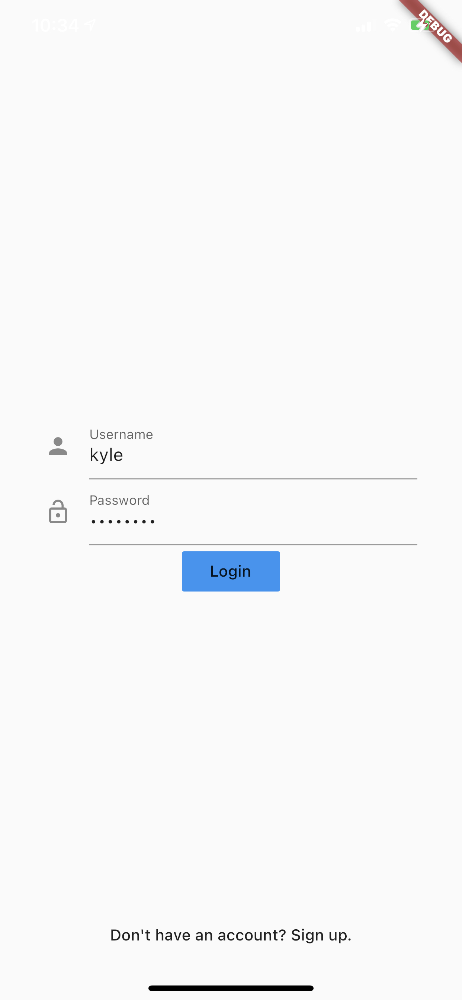

# Introduction

AWS Amplify is a suite of tools that allow developers to build apps quicker by providing easy to use libraries that make it possible to authenticate users, store files, capture analytics events, and much more, with just a few lines of code.

In this module, you'll create and build out the UI of a photo gallery app. This includes the sign-up flow, a gallery page for viewing images, and the ability to take a picture with the camera.

This module will set the foundation of our app so the following modules can focus on the actual Amplify implementations for the specific category.

Here is a gif of what the app will look like at the end this module.


## What You Will Learn

- Implement a sign-up and login flow
- Navigation between screens
- Implement a grid of widgets
- Take pictures with the device camera

## Key Concepts

- Navigator - This tutorial will be using the Flutter Navigator 2.0, which uses a list of pages to determine which view should be displayed using a declarative implementation.
- Callbacks - In order to send data from one object to another, we will be using callbacks for communication. A callback is similar to a function in that it can be passed an arguement from the call site, but it executes code elsewhere.

# Implementation

## Create the Flutter Project

Start Visual Studio Code and create a new Flutter project with a name of your choice.


Once your project is setup, replace the boilerplate code in `main.dart` with the following:

```dart
import 'package:flutter/material.dart';

void main() {
  runApp(MyApp());
}

// 1
class MyApp extends StatefulWidget {
  @override
  State<StatefulWidget> createState() => _MyAppState();
}

class _MyAppState extends State<MyApp> {
  @override
  Widget build(BuildContext context) {
    return MaterialApp(
      title: 'Photo Gallery App',
      theme: ThemeData(visualDensity: VisualDensity.adaptivePlatformDensity),
      // 2
      home: Navigator(
        pages: [],
        onPopPage: (route, result) => route.didPop(result),
      ),
    );
  }
}
```

1. We have changed out `MyApp` widget into a `StatefulWidget`. We will be manipulating its state later.
2. The home widget of our `MaterialApp` is a `Navigator` which will allow setup our navigation in a declarative way.

## Create Auth Flow

Before we can add pages to our `Navigator`, we need to create the widgets that will represent each of our pages. Let's start with the login page which we will put in a new file `login_page.dart`.

```dart
import 'package:flutter/material.dart';

class LoginPage extends StatefulWidget {
  @override
  State<StatefulWidget> createState() => _LoginPageState();
}

class _LoginPageState extends State<LoginPage> {
  // 1
  final _usernameController = TextEditingController();
  final _passwordController = TextEditingController();

  @override
  Widget build(BuildContext context) {
    // 2
    return Scaffold(
      // 3
      body: SafeArea(
          minimum: EdgeInsets.symmetric(horizontal: 40),
          // 4
          child: Stack(children: [
            // Login Form
            _loginForm(),

            // 6
            // Sign Up Button
            Container(
              alignment: Alignment.bottomCenter,
              child: FlatButton(
                  onPressed: () {},
                  child: Text('Don\'t have an account? Sign up.')),
            )
          ])),
    );
  }

  // 5
  Widget _loginForm() {
    return Column(
      mainAxisAlignment: MainAxisAlignment.center,
      children: [
        // Username TextField
        TextField(
          controller: _usernameController,
          decoration:
              InputDecoration(icon: Icon(Icons.mail), labelText: 'Username'),
        ),

        // Password TextField
        TextField(
          controller: _passwordController,
          decoration: InputDecoration(
              icon: Icon(Icons.lock_open), labelText: 'Password'),
          obscureText: true,
          keyboardType: TextInputType.visiblePassword,
        ),

        // Login Button
        FlatButton(
            onPressed: _login,
            child: Text('Login'),
            color: Theme.of(context).accentColor)
      ],
    );
  }

  // 7
  void _login() {
    final username = _usernameController.text.trim();
    final password = _passwordController.text.trim();

    print('username: $username');
    print('password: $password');
  }
}

```

1. Since `LoginPage` requires user input, we need to keep track of that state by having a `TextEditingController` for each field on the screen; in this case: username and password.
2. `_LoginPageState.build` will return a `Scaffold` that will allow our widgets to be formatted properly for a mobile device.
3. It's important to observe the `SafeArea` since the app will be capable of running on multiple devices. In this case, we're also taking advantage of the minimum edge insets to add padding on both the left and right sides of the screen so the login form wont be from edge to edge.
4. Our UI will consist of the primary login form and a button at the bottom of the screen that will allow the user to sign up instead of login. We're using a stack here to make it easier to manipulate the placement of each child widget.
5. Creating a `_loginForm` function is completely optional, but it does declutter the `build` method a bit. Here we are implementing the UI for the username and password textfields, as well as the login button.
6. Out sign up button will take the form of an interactive sentence that allows the user to sign up if they don't already have an account. No `onPressed` functionality is implemented yet.
7. The `_login` method will be responsible for extracting the values from the textfield controllers and creating an `AuthCredentials` object. Right now it is simply printing the values of each controller.

The UI of `LoginPage` is not finished, let's add it to the `Navigator` in `main.dart`.

```dart
... // home: Navigator(

pages: [MaterialPage(child: LoginPage())],

... // onPopPage: (route, result) => route.didPop(result),
```

The `pages` parameter takes a `List<Page<dynamic>>`, so we pass in a single `MaterialPage` where our `LoginPage` is the child.

Give the app a run and you should see your `LoginPage`.



The user will need to be able to sign up befor they can sign in. Let's implement the `SignUpPage` in a new file `sign_up_page.dart`

```dart
import 'package:flutter/material.dart';

class SignUpPage extends StatefulWidget {
  @override
  State<StatefulWidget> createState() => _SignUpPageState();
}

class _SignUpPageState extends State<SignUpPage> {
  final _usernameController = TextEditingController();
  final _emailController = TextEditingController();
  final _passwordController = TextEditingController();

  @override
  Widget build(BuildContext context) {
    return Scaffold(
      body: SafeArea(
          minimum: EdgeInsets.symmetric(horizontal: 40),
          child: Stack(children: [
            // Sign Up Form
            _signUpForm(),

            // Login Button
            Container(
              alignment: Alignment.bottomCenter,
              child: FlatButton(
                  onPressed: () {},
                  child: Text('Already have an account? Login.')),
            )
          ])),
    );
  }

  Widget _signUpForm() {
    return Column(
      mainAxisAlignment: MainAxisAlignment.center,
      children: [
        // Username TextField
        TextField(
          controller: _usernameController,
          decoration:
              InputDecoration(icon: Icon(Icons.person), labelText: 'Username'),
        ),

        // Email TextField
        TextField(
          controller: _emailController,
          decoration:
              InputDecoration(icon: Icon(Icons.mail), labelText: 'Email'),
        ),

        // Password TextField
        TextField(
          controller: _passwordController,
          decoration: InputDecoration(
              icon: Icon(Icons.lock_open), labelText: 'Password'),
          obscureText: true,
          keyboardType: TextInputType.visiblePassword,
        ),

        // Sign Up Button
        FlatButton(
            onPressed: _signUp,
            child: Text('Sign Up'),
            color: Theme.of(context).accentColor)
      ],
    );
  }

  void _signUp() {
    final username = _usernameController.text.trim();
    final email = _emailController.text.trim();
    final password = _passwordController.text.trim();

    print('username: $username');
    print('email: $email');
    print('password: $password');
  }
}
```

Our `SignUpPage` is almost identical to the `LoginPage` with the exception that it has an additional field for email and the text for the buttons have been changed.

Let's add the `SignUpPage` as a `MaterialPage` in the Navigator of `main.dart` too.

```dart
... // home: Navigator(

pages: [
  MaterialPage(child: LoginPage()),
  MaterialPage(child: SignUpPage())
],

... // onPopPage: (route, result) => route.didPop(result),
```

Now run the app.


The sign up screen should now be showing when the app launches since it is the last page implemented in the `pages` list of our `Navigator`. The `Navigator` treats the `pages` argument like a stack, where the last in is on top. This means we are currently seeing the `SignUpPage` stacked on top of `LoginPage`.

If we want to display different pages, we will have to implement logic inside of our list to determine when to display specific pages. We can accomplish these updates by creating a `Stream` and nesting our `Navigator` in a `StreamBuilder`. 

Create a new file called `auth_service.dart` and add the following:

```dart
import 'dart:async';

// 1
enum AuthFlowStatus { login, signUp, verification, session }

// 2
class AuthState {
  final AuthFlowStatus authFlowStatus;

  AuthState({this.authFlowStatus});
}

// 3
class AuthService {
  // 4
  final authStateController = StreamController<AuthState>();

  // 5
  void showSignUp() {
    final state = AuthState(authFlowStatus: AuthFlowStatus.signUp);
    authStateController.add(state);
  }

  // 6
  void showLogin() {
    final state = AuthState(authFlowStatus: AuthFlowStatus.login);
    authStateController.add(state);
  }
}
```

1. `AuthFlowStatus` is an enumeration that will cover the four different states our auth flow can be in: the login page, sign-up page, verification page, or a session. We will be adding the last two pages shortly.
2. `AuthState` is the actual object we will be observing in our stream and it will contain `authFlowStatus` as a property.
3. Our `AuthService` will serve two purposes, manage the stream controller of `AuthState` as well as contain all of our authentication functionality that will be added in the next module.
4. `authStateController` is responsible for sending new `AuthState`'s down stream to be observed.
5. This is a simple function to update the `AuthState` stream to `signUp`.
6. This does the same as `showSignUp` but updates the stream to send `login`. 

Open `main.dart` again and add create an instance of `AuthService` in `_MyAppState`.

```dart
... // class _MyAppState extends State<MyApp> {

final _authService = AuthService();

... // @override
```

Now we can wrap the `Navigator` in a `StreamBuilder`.

```dart
... // theme: ThemeData(visualDensity: VisualDensity.adaptivePlatformDensity),

// 1
home: StreamBuilder<AuthState>(
    // 2
    stream: _authService.authStateController.stream,
    builder: (context, snapshot) {
      // 3
      if (snapshot.hasData) {
        return Navigator(
          pages: [
            // 4
            // Show Login Page
            if (snapshot.data.authFlowStatus == AuthFlowStatus.login)
              MaterialPage(child: LoginPage()),

            // 5
            // Show Sign Up Page
            if (snapshot.data.authFlowStatus == AuthFlowStatus.signUp)
              MaterialPage(child: SignUpPage())
          ],
          onPopPage: (route, result) => route.didPop(result),
        );
      } else {
        // 6
        return Container(
          alignment: Alignment.center,
          child: CircularProgressIndicator(),
        );
      }
    }),
    
... // MaterialApp closing ); 
```

1. We wrapped our `Navigator` with a `StreamBuilder` that is expecting to observe a stream emitting `AuthState`.
2. We access the `AuthState` stream by accessing it from the `authStateController` from the instance of `AuthService`.
3. The stream may or may not have data. In order to safely access `authFlowStatus` from our data, which is of type `AuthState`, we implement the check here first.
4. If the stream emits `AuthFlowStatus.login` we will show `LoginPage`.
5. If the stream emits `AuthFlowStatus.signUp` we will show `SignUpPage`.
6. If the stream doesn't have data, a `CircularProgressIndicator` is displayed.

To ensure stream has data from the start, a value needs to be emitted immediately. We can accomplish this by sending `AuthFlowStatus.login` when `_MyAppState` is initialized.

```dart
... // final _authService = AuthService();

@override
void initState() {
 super.initState();
 _authService.showLogin();
}

... // @override
```

If we run the app now, it should be displaying `LoginPage` as that's the only value that has been emitted through the stream.

We still need to implement the ability to switch between `LoginPage` and `SignUpPage`.

Navigate to `login_page.dart` and add the following:

```dart
... // class LoginPage extends StatefulWidget {

final VoidCallback shouldShowSignUp;

LoginPage({Key key, this.shouldShowSignUp}) : super(key: key);

... // @override
```

Our constructor is now accepting a `VoidCallback` as an arguement which can trigger some functionality in `main.dart` and called from `_LoginPageState`.

Pass `shouldShowSignUp` as the argument for the sign up button in our `_LoginPageState`:

```dart
... // child: FlatButton(

onPressed: widget.shouldShowSignUp,

... // child: Text('Don\'t have an account? Sign up.')),
```

Back in `main.dart` we need to pass an arguement for the `shouldShowSignUp` parameter of the `LoginPage`:

```dart
... // if (snapshot.data.authFlowStatus == AuthFlowStatus.login)

MaterialPage(
   child: LoginPage(
       shouldShowSignUp: _authService.showSignUp))

... // Show Sign Up Page
```

Run the app and press the sign up button on `LoginPage`. It should now navigate to `SignUpPage`

We need to be able to do the same thing for `SignUpPage` so the user can switch between sign up and login by tapping the button at the bottom of the screen.

Add the following to `sign_up_page.dart`:

```dart
... // class SignUpPage extends StatefulWidget {

final VoidCallback shouldShowLogin;

SignUpPage({Key key, this.shouldShowLogin}) : super(key: key);

... // @override
```

```dart
... // child: FlatButton(

onPressed: widget.shouldShowLogin,

... // child: Text('Already have an account? Login.')),
```

Just as we implemented with `LoginPage`, `SignUpPage` will trigger the `VoidCallback` when the user presses the botton at the bottom of the screen.

Now to simply update `main.dart` to accept an arguement for `shouldShowLogin`.

```dart
... // if (snapshot.data.authFlowStatus == AuthFlowStatus.signUp)

MaterialPage(
   child: SignUpPage(
       shouldShowLogin: _authService.showLogin))

... // pages closing ],
```

If you run the app this time, you'll notice you're able to toggle between the `LoginPage` and `SignUpPage`.

The last thing needed for each of these pages is a way to pass the user input for each field as credentials that can be processed for login/sign up.

Create a new file called `auth_credentials.dart` and add the following:

```dart
// 1
abstract class AuthCredentials {
  final String username;
  final String password;

  AuthCredentials({this.username, this.password});
}

// 2
class LoginCredentials extends AuthCredentials {
  LoginCredentials({String username, String password})
      : super(username: username, password: password);
}

// 3
class SignUpCredentials extends AuthCredentials {
  final String email;

  SignUpCredentials({String username, String password, this.email})
      : super(username: username, password: password);
}
```

1. `AuthCredentials` is an abstract class that we will use for a baseline of the minimum info needed to perform either login or sign up. This will allow us to use `LoginCredentials` and `SignUpCredentials` almost interchangeably.
2. `LoginCredentials` a simple concrete implementation of `AuthCredentials` as logging in only requires the username and password.
3. Almost exactly the same as the `LoginCredentials` but with email being an added field required for signing up.

We can now add login and sign up methods to `AuthService` which will accept the respective credentials and change the state of the `Navigator` to the correct page.

Add these two functions to `auth_service.dart`:

```dart
... // showLogin closing }

// 1
void loginWithCredentials(AuthCredentials credentials) {
 final state = AuthState(authFlowStatus: AuthFlowStatus.session);
 authStateController.add(state);
}

// 2
void signUpWithCredentials(SignUpCredentials credentials) {
 final state = AuthState(authFlowStatus: AuthFlowStatus.verification);
 authStateController.add(state);
}

... // AuthService closing }
```

1. When a user passes any `AuthCredentials` we will perform some logic and ultimately put the user in a `session` state.
2. Signing up will require that the email entered is verified by entering a verification code. Thus, the sign up logic should chage the state to `verification`.

Let's start by updating `LoginPage` to send `LoginCredentials` via a `ValueChanged` property.

```dart
... // class LoginPage extends StatefulWidget {

final ValueChanged<LoginCredentials> didProvideCredentials;

... // final VoidCallback shouldShowSignUp;

LoginPage({Key key, this.didProvideCredentials, this.shouldShowSignUp})
   : super(key: key);

... // @override
```

We can now pass our credentials from the `_login()` method in `_LoginPageState`:

```dart
... // print('password: $password');

final credentials =
  LoginCredentials(username: username, password: password);
widget.didProvideCredentials(credentials);

... // _login closing }
```

Let's implement something similar for `SignUpPage`:

```dart
... // class SignUpPage extends StatefulWidget {

final ValueChanged<SignUpCredentials> didProvideCredentials;

... // final VoidCallback shouldShowLogin;

SignUpPage({Key key, this.didProvideCredentials, this.shouldShowLogin})
   : super(key: key);

... // @override
```

And create the credentials:

```dart
... // print('password: $password');

final credentials = SignUpCredentials(
   username: username, 
   email: email, 
   password: password
);
widget.didProvideCredentials(credentials);

... // _signUp closing }
```

Now connect everything in `main.dart`:

```dart
... // child: LoginPage(

didProvideCredentials: _authService.loginWithCredentials,

... // shouldShowSignUp: _authService.showSignUp)),
```

```dart
... // child: SignUpPage(

didProvideCredentials: _authService.signUpWithCredentials,

... // shouldShowLogin: _authService.showLogin))
```

That wraps up `LoginPage` and `SignUpPage`, but as we saw with `AuthFlowStatus` we still need to implement a page for verification and pages to represent a session.

Let's add `VerificationPage` in a new file `verification_page.dart`:

```dart
import 'package:flutter/material.dart';

class VerificationPage extends StatefulWidget {
  final ValueChanged<String> didProvideVerificationCode;

  VerificationPage({Key key, this.didProvideVerificationCode})
      : super(key: key);

  @override
  State<StatefulWidget> createState() => _VerificationPageState();
}

class _VerificationPageState extends State<VerificationPage> {
  final _verificationCodeController = TextEditingController();

  @override
  Widget build(BuildContext context) {
    return Scaffold(
      body: SafeArea(
        minimum: EdgeInsets.symmetric(horizontal: 40),
        child: _verificationForm(),
      ),
    );
  }

  Widget _verificationForm() {
    return Column(
      mainAxisAlignment: MainAxisAlignment.center,
      children: [
        // Verification Code TextField
        TextField(
          controller: _verificationCodeController,
          decoration: InputDecoration(
              icon: Icon(Icons.confirmation_number),
              labelText: 'Verification code'),
        ),

        // Verify Button
        FlatButton(
            onPressed: _verify,
            child: Text('Verify'),
            color: Theme.of(context).accentColor)
      ],
    );
  }

  void _verify() {
    final verificationCode = _verificationCodeController.text.trim();
    widget.didProvideVerificationCode(verificationCode);
  }
}
```

The `VerificationPage` is really just a slimmed down version of `LoginPage` and only passes a verification code up the widget tree.

Back in `auth_service.dart`, there needs to be a method to handle the verification code and update the state to `session`.

```dart
... // signUpWithCredentials closing }

void verifyCode(String verificationCode) {
 final state = AuthState(authFlowStatus: AuthFlowStatus.session);
 authStateController.add(state);
}

... // AuthService closing }
```

Now add the `VerificationPage` to the `Navigator` of `main.dart`.

```dart
... // shouldShowLogin: _authService.showLogin)),

// Show Verification Code Page
if (snapshot.data.authFlowStatus == AuthFlowStatus.verification)
  MaterialPage(child: VerificationPage(
    didProvideVerificationCode: _authService.verifyCode))

... // pages closing ],
```

## Create Camera/Gallery Flow

With `VerificationPage` implemented, we can move onto the UI for when a user has signed in. We will be displaying a gallery of images and have the ability to take a picture with the device camera. We will create a `CameraFlow` widget that will handle state changes dictating when to show each screen.

Create a new file called `camera_flow.dart` and add the following:

```dart
import 'package:flutter/material.dart';

class CameraFlow extends StatefulWidget {
  // 1
  final VoidCallback shouldLogOut;

  CameraFlow({Key key, this.shouldLogOut}) : super(key: key);

  @override
  State<StatefulWidget> createState() => _CameraFlowState();
}

class _CameraFlowState extends State<CameraFlow> {
  // 2
  bool _shouldShowCamera = false;

  // 3
  List<MaterialPage> get _pages {
    return [
      // Show Gallery Page
      MaterialPage(child: Placeholder()),

      // Show Camera Page
      if (_shouldShowCamera) 
      MaterialPage(child: Placeholder())
    ];
  }

  @override
  Widget build(BuildContext context) {
    // 4
    return Navigator(
      pages: _pages,
      onPopPage: (route, result) => route.didPop(result),
    );
  }

  // 5
  void _toggleCameraOpen(bool isOpen) {
    setState(() {
      this._shouldShowCamera = isOpen;
    });
  }
}
```

1. `CameraFlow` will need to trigger when the user is logging out and update the state back in `main.dart`. We will implement this functionality shortly after creating the `GalleryPage`.
2. This flag will act as the state responsible for when the camera should show or not.
3. To ensure our `Navigator` is updated when `_shouldShowCamera` is updated, we're using a computed property to return the correct navigation stack based on the current state. We're currently using `Placeholder` pages for now.
4. Similar to `_MyAppState` we are using a `Navigator` widget to determine which page should be show at any given time for a session.
5. This method will allow us to toggle whether the camera is shown or not without having to implement `setState()` at the call site.

Create the `GalleryPage` in `gallery_page.dart`:

```dart
import 'package:flutter/material.dart';

// 1
class GalleryPage extends StatelessWidget {
  // 2
  final VoidCallback shouldLogOut;
  // 3
  final VoidCallback shouldShowCamera;

  GalleryPage({Key key, this.shouldLogOut, this.shouldShowCamera})
    : super(key: key);

  @override
  Widget build(BuildContext context) {
    return Scaffold(
      appBar: AppBar(
        title: Text('Gallery'),
        actions: [
          // 4
          // Log Out Button
          Padding(
            padding: const EdgeInsets.all(8),
            child:
                GestureDetector(child: Icon(Icons.logout), onTap: shouldLogOut),
          )
        ],
      ),
      // 5
      floatingActionButton: FloatingActionButton(
          child: Icon(Icons.camera_alt), onPressed: shouldShowCamera),
      body: Container(child: _galleryGrid()),
    );
  }

  Widget _galleryGrid() {
    // 6
    return GridView.builder(
        gridDelegate:
            SliverGridDelegateWithFixedCrossAxisCount(crossAxisCount: 2),
        itemCount: 3,
        itemBuilder: (context, index) {
          // 7
          return Placeholder();
        });
  }
}
```

1. `GalleryPage` will simply display images, so it can be implemented as a `StatelessWidget`.
2. This `VoidCallback` will connect to the `shouldLogOut` method in `CameraFlow`.
3. This `VoidCallback` will update the `_shouldShowCamera` flag in `CameraFlow`.
4. Our log out button is implemented as an action in the `AppBar` and is calling `shouldLogOut` when tapped.
5. This `FloatingActionButton` will trigger our camera to show when pressed.
6. Our images will be displayed in a grid with two columns. We are currently hardcoding 3 items in this grid.
7. We will implement an image loading widget in the [Add Stroage](05_add_storage.md) module. Until then, we will use `Placeholder` to represent images.

We can now replace the `Placeholder` in our `CameraFlow._pages` with the newly created `GalleryPage`.

```dart
... // Show Gallery Page

MaterialPage(
    child: GalleryPage(
        shouldLogOut: widget.shouldLogOut,
        shouldShowCamera: () => _toggleCameraOpen(true))),

... // Show Camera Page
```

To simplify creating a `CameraPage` we will add a couple of dependencies to the `pubspec.yaml` file:

```yaml
... # cupertino_icons: ^1.0.0

camera:
path_provider:
path:

... # dev_dependencies:
```

We also need to make a few configuration update to each platform.

On Android, update `minSdkVersion` to 21 (android > app > build.gradle)

```groovy
... // defaultConfig {
...

minSdkVersion 21

... // targetSdkVersion 29
```

For iOS, update the `Info.plist` to allow accessing the camera. (ios > Runner > Info.plist):

```xml
... <!-- <false/> -->

<key>NSCameraUsageDescription</key>
<string>Need the camera to take pictures.</string>

... <!-- </dict> -->
```

Now add this to a new file called `camera_page.dart`:

```dart
import 'package:camera/camera.dart';
import 'package:flutter/material.dart';
import 'package:path/path.dart';
import 'package:path_provider/path_provider.dart';

class CameraPage extends StatefulWidget {
  // 1
  final CameraDescription camera;
  // 2
  final ValueChanged didProvideImagePath;

  CameraPage({Key key, this.camera, this.didProvideImagePath})
      : super(key: key);

  @override
  State<StatefulWidget> createState() => _CameraPageState();
}

class _CameraPageState extends State<CameraPage> {
  CameraController _controller;
  Future<void> _initializeControllerFuture;

  @override
  void initState() {
    super.initState();
    // 3
    _controller = CameraController(widget.camera, ResolutionPreset.medium);
    _initializeControllerFuture = _controller.initialize();
  }

  @override
  Widget build(BuildContext context) {
    return Scaffold(
      body: FutureBuilder<void>(
        future: _initializeControllerFuture,
        builder: (context, snapshot) {
          // 4
          if (snapshot.connectionState == ConnectionState.done) {
            return CameraPreview(this._controller);
          } else {
            return Center(child: CircularProgressIndicator());
          }
        },
      ),
      // 5
      floatingActionButton: FloatingActionButton(
          child: Icon(Icons.camera), onPressed: _takePicture),
    );
  }

  // 6
  void _takePicture() async {
    try {
      await _initializeControllerFuture;

      final tmpDirectory = await getTemporaryDirectory();
      final filePath = '${DateTime.now().millisecondsSinceEpoch}.png';
      final path = join(tmpDirectory.path, filePath);

      await _controller.takePicture(path);

      widget.didProvideImagePath(path);
    } catch (e) {
      print(e);
    }
  }

  // 7
  @override
  void dispose() {
    _controller.dispose();
    super.dispose();
  }
}

```

1. In order to take a picture, we will need to obtain an instance of `CameraDescription` which will be provided by the `CameraFlow`.
2. This `ValueChanged` will provide the `CameraFlow` with the local path to the image that is captured by the camera.
3. To ensure we have a `CameraController` instance, we initialize it in the `initState` method and initialize `_initializeControllerFuture` once it has finished.
4. The `FutureBuilder` will then observe when the `Future` is returned and either show a preview of what the camera sees, or a `CircularProgressIndicator`.
5. The `FloatingActionButton` will trigger `_takePicture()` when pressed.
6. This method will construct a temporary path to the image location and pass it back to `CameraFlow` through `didProvideImagePath`.
7. Finally, we need to ensure we dispose of the `CameraController` once the page has been disposed.

Back in `CameraFlow` we need to create the `CameraDescription` instance.

```dart
... // class _CameraFlowState extends State<CameraFlow> {

CameraDescription _camera;

... // bool _shouldShowCamera = false;
```

Create a function to get and initialze the `_camera`.

```dart
... // _toggleCameraOpen closing }

void _getCamera() async {
  final camerasList = await availableCameras();
  setState(() {
    final firstCamera = camerasList.first;
    this._camera = firstCamera;
  });
}

... // _CameraFlowState closing }
```

We will call this function as soon as `_CameraFlowState` is initialized.

```dart
... // _pages closing }

@override
void initState() {
 super.initState();
 _getCamera();
}

... // @override of build
```

Lastly, replace the `Placeholder` in `_pages` with an instance of `CameraPage`

```dart
... // if (_shouldShowCamera)

MaterialPage(
   child: CameraPage(
       camera: _camera,
       didProvideImagePath: (imagePath) {
         this._toggleCameraOpen(false);
       }))

... // _pages closing ];
```

Now the `CameraPage` will be initialized with a camera and return the `imagePath` once an image is taken. We are only closing the camera once a picture is taken right now.

## Add Log Out

To close the navigation loop of our UI, we need to add a log out method to `AuthService`.

```dart
... // verifyCode closing }

void logOut() {
 final state = AuthState(authFlowStatus: AuthFlowStatus.login);
 authStateController.add(state);
}

... // AuthService closing }
```

Finally, implement the case for `CameraFlow` in the `Navigator.pages` of `main.dart`.

```dart
... // _authService.verifyCode)),

// Show Camera Flow
if (snapshot.data.authFlowStatus == AuthFlowStatus.session)
  MaterialPage(
      child: CameraFlow(shouldLogOut: _authService.logOut))

... // pages closing ],
```

## Test the App

If you run the app again, you should be able to navigate through all screens of the app.


You have succussfully implemented the UI of the Photo Gallery app in Flutter.

Now you can move onto implementing Amplify into your project 🎉

[Next](03_initialize_amplify.md): Initialize Amplify
