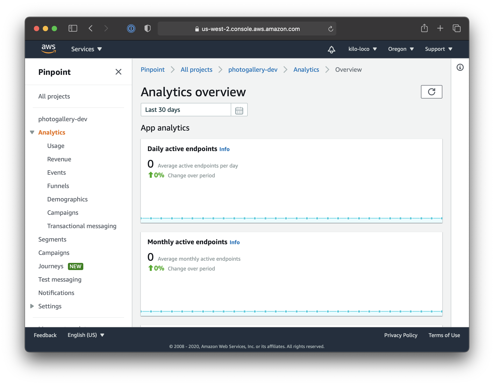
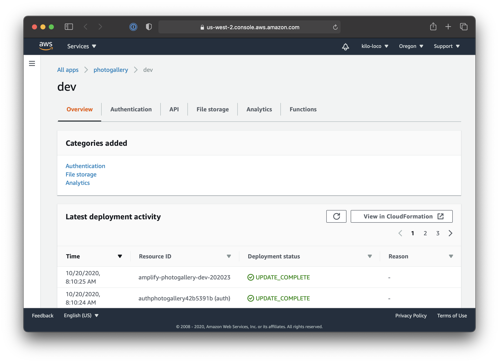
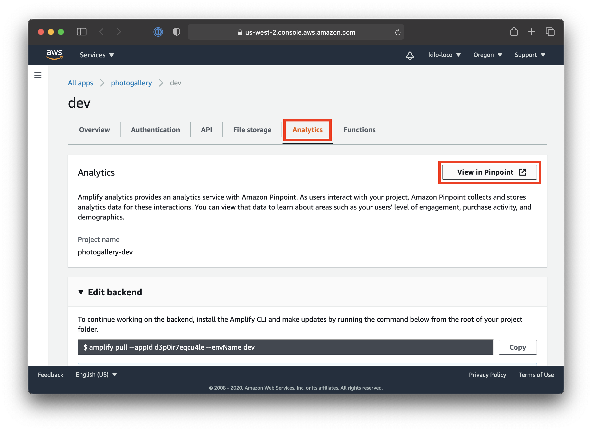
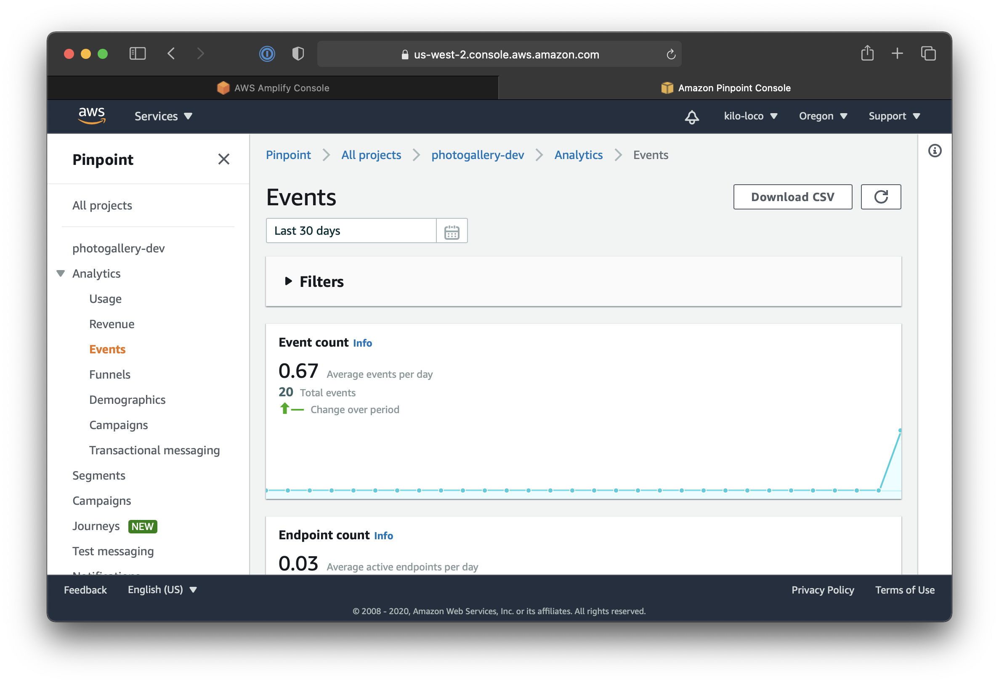

# Introduction

The Photo Gallery app is now fully functional with the ability to authenticate a user and allow them to take pictures that are uploaded to Storage. Now we need to focus on recording analytics to understand how users are interacting with our app.

In this module, we will add the Analytics category to our Amplify app, create custom analytics events, implement those events, and view the [AWS Pinpoint](https://aws.amazon.com/pinpoint/) dashboard to see our analytics being tracked.

## What You Will Learn

- Configure the Analytics category
- Record analytics events to AWS Pinpoint
- View the AWS Pinpoint dashboard

## Key Concepts

- Analytics - Recording when events occur for each instance of the app can be a valuable way to collect analytics on user behavior, leading to a better understanding of what features are most important to the app.

# Implementation

## Create the Analytics Service

Add the Analytics service to your Amplify project by running the following in the terminal at the root directory of your project:

```shell
amplify add analytics
```

The Amplify CLI will ask a series of questions to configure the Analytics service. Press the **Enter** key to provide the default answer to each question. The output should look like this:

```shell
➜  photo_gallery git:(master) ✗ amplify add analytics
? Select an Analytics provider Amazon Pinpoint
? Provide your pinpoint resource name: photogallery
Adding analytics would add the Auth category to the project if not already added.
? Apps need authorization to send analytics events. Do you want to allow guests
and unauthenticated users to send analytics events? (we recommend you allow this
 when getting started) Yes
```

After the resource is fully configured, you will receive an output like the following:

```shell
Successfully updated auth resource locally.
Successfully added resource photogallery locally
```

Take note that adding Analytics will update our Auth category. We will be able to confirm this before configuring out backend by running:

```shell
amplify push
```

We should get a status report of the changes made to our Amplify app:

```shell
➜  photo_gallery git:(master) ✗ amplify push
✔ Successfully pulled backend environment dev from the cloud.

Current Environment: dev

| Category  | Resource name        | Operation | Provider plugin   |
| --------- | -------------------- | --------- | ----------------- |
| Analytics | photogallery         | Create    | awscloudformation |
| Auth      | photogallery42b5391b | Update    | awscloudformation |
| Storage   | s33daafe54           | No Change | awscloudformation |
? Are you sure you want to continue? Yes
```

After the Analytics resource is configured in the backend, you should see a success message along with a link to your app's Pinpoint dashboard:

```shell
✔ All resources are updated in the cloud

Pinpoint URL to track events https://us-west-2.console.aws.amazon.com/pinpoint/home/?region=us-west-2#/apps/ca14fce9dd034d6dbd7ca3ec27afc67c/analytics/overview
```

Click the link to view the dashboard. It should look like this:



We will revisit the dashboard after recording a few analytic events.

## Installing the Dependency

In Visual Studio Code, open `pubspec.yaml` and add Amplify Analytics as a dependency:

```yaml
... # amplify_storage_s3: '<1.0.0'

amplify_analytics_pinpoint: '<1.0.0'

... # cached_network_image: ^2.3.3
```

Now save the file to have Visual Studio Code install the Amplify Auth Cognito plugin. You can also run `$ flutter pub get` from the terminal if the dependency isn't installed on save.

You should get an output of:

```shell
exit code 0
```

## Configure the Plugin

Open `main.dart` and add the Analytics plugin to the instance of Amplify used to configure the other plugins:

```dart
... // void _configureAmplify() async {

_amplify.addPlugin(
    authPlugins: [AmplifyAuthCognito()],
    storagePlugins: [AmplifyStorageS3()],
    analyticsPlugins: [AmplifyAnalyticsPinpoint()]);

... // try {
```

Run the app. You should still see the success message in the logs indicating that Amplify is still properly configured and is including the Storage plugin.

```shell
flutter: Successfully configured Amplify 🎉
```

## Implement Functionality

Amplify Analytics makes it extremely easy to record analytics events by doing something like:

```dart
final myEvent = AnalyticsEvent('my_event_name');
myEvent.properties.addStringProperty('property_name', 'property_value');
Amplify.Analytics.recordEvent(event: myEvent);
```

However, defining and creating events at arbitrary points in the app can become tedious to maintain. Instead, we will define all the analytics events in a single file and make each event its own object.

Create a new file called `analytics_events.dart` and add the following:

```dart
import 'package:amplify_analytics_pinpoint/amplify_analytics_pinpoint.dart';

abstract class AbstractAnalyticsEvent {
  final AnalyticsEvent value;

  AbstractAnalyticsEvent.withName({String eventName})
      : value = AnalyticsEvent(eventName);
}

class LoginEvent extends AbstractAnalyticsEvent {
  LoginEvent() : super.withName(eventName: 'login');
}

class SignUpEvent extends AbstractAnalyticsEvent {
  SignUpEvent() : super.withName(eventName: 'sign_up');
}

class VerificationEvent extends AbstractAnalyticsEvent {
  VerificationEvent() : super.withName(eventName: 'verification');
}

class ViewGalleryEvent extends AbstractAnalyticsEvent {
  ViewGalleryEvent() : super.withName(eventName: 'view_gallery');
}
```

By creaating `AbstractAnalyticsEvent`, we can create custom analytics event objects that all have a common property, `value`, which will contain the `AnalyticsEvent` instance. With one line of code, we will be able to instantiate an `AbstractAnalyticsEvent` while keeping the implementation details in a single file.

We can take this one step further. Let's create an `AbstractAnalyticsEvent` for when a user takes a picture, but let's also give it the ability to track whether the user used the front or back camera of their device. To be able to accomplish this, we first need to add another constructor to `AbstractAnalyticsEvents` accepts an `AnalyticsEvent` as a parameter.

```dart
... // : value = AnalyticsEvent(eventName);

AbstractAnalyticsEvent.withEvent({AnalyticsEvent event}) 
      : value = event;

... // AbstractAnalyticsEvent closing }
```

Now we can implement `TakePictureEvent`:

```dart
class TakePictureEvent extends AbstractAnalyticsEvent {
  // 1
  TakePictureEvent._fromEvent(AnalyticsEvent event)
      : super.withEvent(event: event);

  // 2
  factory TakePictureEvent({@String cameraDirection}) {
    final event = AnalyticsEvent('take_picture');
    event.properties.addStringProperty('camera_direction', cameraDirection);
    return TakePictureEvent._fromEvent(event);
  }
}
```

1. We create a private constructor called `_fromEvent` which will allow us to call the super constructor that accepts an `AnalyticsEvent` as a parameter.
2. The factory constructor will be the one we use to create this event and accepts a String parameter, allowing a camera direction to be included as a property of the `AnalyticsEvent`.

Now let's create an object with the ability to turn an instance of our `AbstractAnalyticsEvent` into an `AnalyticsEvent`. Create a new file called `analytics_service` and add the following:

```dart
import 'package:amplify_core/amplify_core.dart';
import 'analytics_events.dart';

class AnalyticsService {
  static void log(AbstractAnalyticsEvent event) {
    Amplify.Analytics.recordEvent(event: event.value);
  }
}
```

The `AnalyticsService` is simple, it has a static method called `log` which will take an `AbstractAnalyticsEvent` and pass the `value` to `Amplify.Analytics`. That's it.

Now we can implement each of our concreate `AbstractAnalyticsEvent` classes.

Add `LoginEvent` to the `_login` function in `login_page.dart`:

```dart
... // widget.didProvideCredentials(credentials);

AnalyticsService.log(LoginEvent());

... // _login closing }
```

Add `SignUpEvent` to the `_signUp` function in `sign_up_page.dart`:

```dart
... // widget.didProvideCredentials(credentials);

AnalyticsService.log(SignUpEvent());

... // _signUp closing }
```

Add `VerificationEvent` to the `_verify` function in `verification_page.dart`:

```dart
... // widget.didProvideVerificationCode(verificationCode);

AnalyticsService.log(VerificationEvent());

... // _verify closing }
```

Add `ViewGalleryEvent` to the constructor in `gallery_page.dart`:

```dart
... // : super(key: key) {

AnalyticsService.log(ViewGalleryEvent());

... // constructor closing }
```

Lastly, add `TakePictureEvent` to `_takePicture` in `camera_page.dart`:

```dart
... // widget.didProvideImagePath(path);

AnalyticsService.log(TakePictureEvent(
    cameraDirection: widget.camera.lensDirection.toString()));

... // } catch (e) {
```

We're able to pass the `lensDirection` to our event since the constructor takes a string arguement.

Run through the app and try to hit all of the different events so they are recorded at least once.

Once you've triggered some of the analytics events to be recorded, head over to the Pinpoint dashboard. If you've closed that window, you can get back by running the following:

```shell
amplify console
```

You should see the overview of you Amplify project:



Navigate to the Analytics tab and click the "View in Pinpoint" button:



Navigate to the analytics events section and you should be able to see how many analytics events were recorded:



In this case, I was able to trigger 20 different events in the Photo Gallery app, showing that we have successfully implemented Amplify Analytics into our app.

Feel free to add even more analytics or make the current ones more verbose. Then you'll be able to really understand how users interact with your app so you know which areas to focus on improving 😉

[Next](07_clean_up.md): Clean Up