# Getting Started with AWS Amplify on macOS

The latest release of the [AWS Amplify Libraries for Swift](https://aws.amazon.com/blogs/mobile/introducing-the-aws-amplify-library-for-swift/) addresses the most popular [issue](https://github.com/aws-amplify/amplify-swift/issues/1124) on the [Amplify Swift](https://github.com/aws-amplify/amplify-swift) (formerly Amplify iOS) GitHub repo, macOS support. The Amplify Libraries are now in beta for macOS and support Analytics, API, Auth, DataStore, Geo, and Storage.

In this blog post, you will learn to use Amplify Auth sign in with web UI to authenticate a user across both macOS and iOS.

Start by creating a macOS application in Xcode:

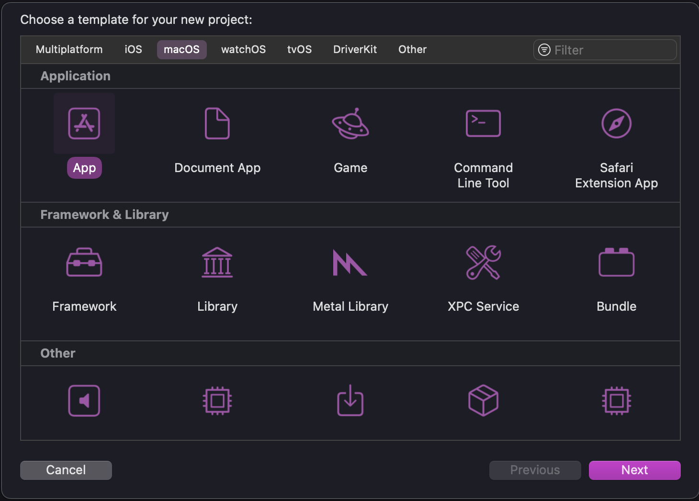

Give your app a name and make sure that SwiftUI is selected for **Interface**:

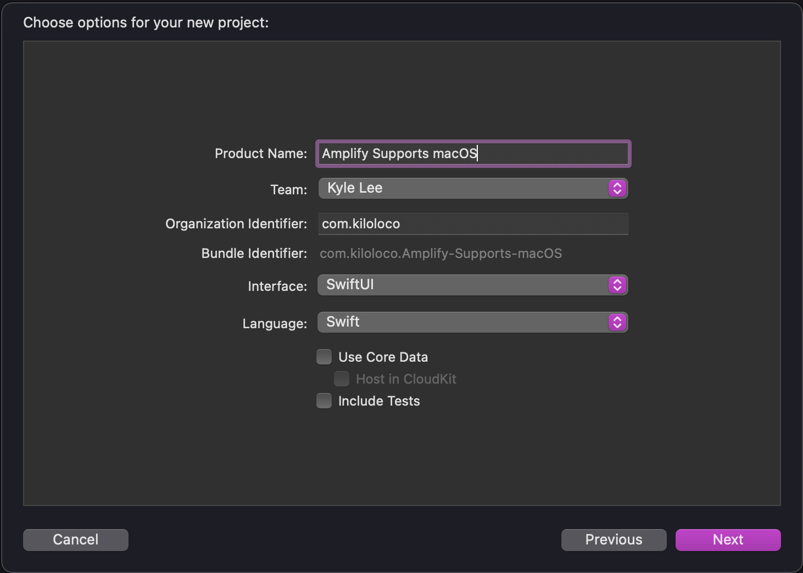

 macOS apps do not have access to the internet by default, so you need to enable outgoing networking connections so the web sign in will have access to the internet. 
 
 Navigate to **Signing & Capabilities** (`Project > Targets > Signing & Capabilities`) and enable **Outgoing Connections (Client)** under the **App Sandbox** section:

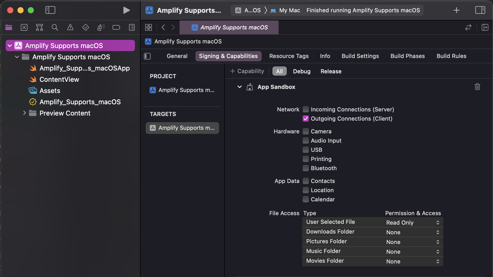

Additionally, Amplify Auth will attempt to save the authentication session to the user's keychain. Add **Keychain Sharing** (`+ Capabilities > Keychain Sharing`) as one of the capabilities for the app as well:

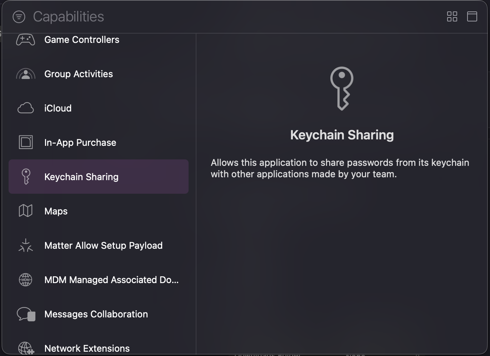

Add a value to **Keychain Sharing** by clicking the plus (**+**). The application bundle ID will be the default value, which will work fine for this use case:

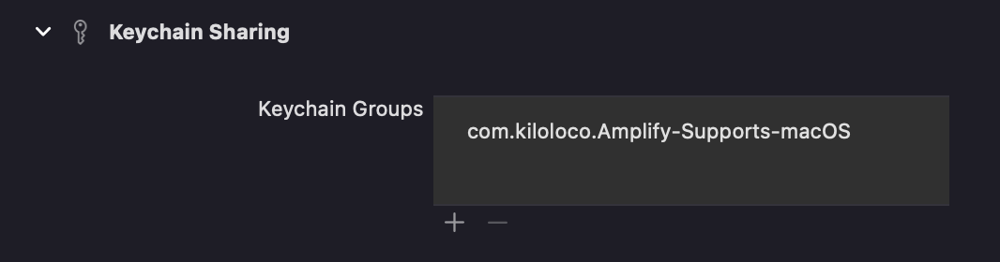

Next, navigate to the **Info.plist** (`Project > Targets > Info`) and add a URI for your app under **URL Schemes**:

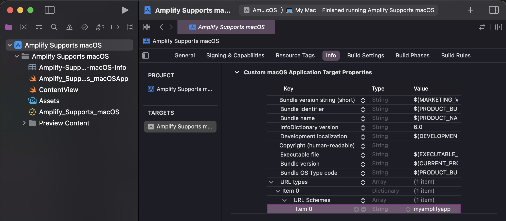

Now that Xcode is ready to work with outgoing connections, save data to the keychain, and has a URI; it's time to configure the Amplify project from the Terminal.

Run the following command to initialize an Amplify project in your Xcode project's root directory:

```bash
amplify init
```

You can press **Enter** to provide the default value for each prompt. My answers to each prompt are listed in the following snippet:

```bash
? Enter a name for the project AmplifySupportsmacOS
The following configuration will be applied:

Project information
| Name: AmplifySupportsmacOS
| Environment: dev
| Default editor: Visual Studio Code
| App type: ios

? Initialize the project with the above configuration? Yes
Using default provider  awscloudformation
? Select the authentication method you want to use: AWS profile
? Please choose the profile you want to use default
Adding backend environment dev to AWS Amplify app: d3ic3w03wz3dwc
✔ Help improve Amplify CLI by sharing non sensitive configurations on failures (y/N) · no
```

Once your Amplify project has been successfully initialized, you can add the Auth category by running the following command:

```bash
amplify add auth
```

Enter the following values for each prompt to successfully setup the Auth category to support web sign in:

```bash
 Do you want to use the default authentication and security configuration? Default configuration with Social Provider (Federation)
 How do you want users to be able to sign in? Username
 Do you want to configure advanced settings? No, I am done.
 What domain name prefix do you want to use? amplifysupportsmacos218806f8-218806f8
 Enter your redirect signin URI: myamplifyapp://
? Do you want to add another redirect signin URI No
 Enter your redirect signout URI: myamplifyapp://
? Do you want to add another redirect signout URI No
 Select the social providers you want to configure for your user pool:
```

The three most important values to properly setup web sign in are selecting the default configuration with social provider and the URI values which must match what was entered in the **Info.plist** above.

You have created the Auth configuration locally. Now push the configuration to the cloud by running the following command:

```bash
amplify push -y
```

> The `-y` flag allows you to push your configuration without needing to confirm the changes that will be applied to your Amplify project.

Once you have successfully deployed the Auth configuration to the cloud, open Xcode to add the generated configuration files to the Xcode project (`File > Add files to "YOUR_PROJECT"`):

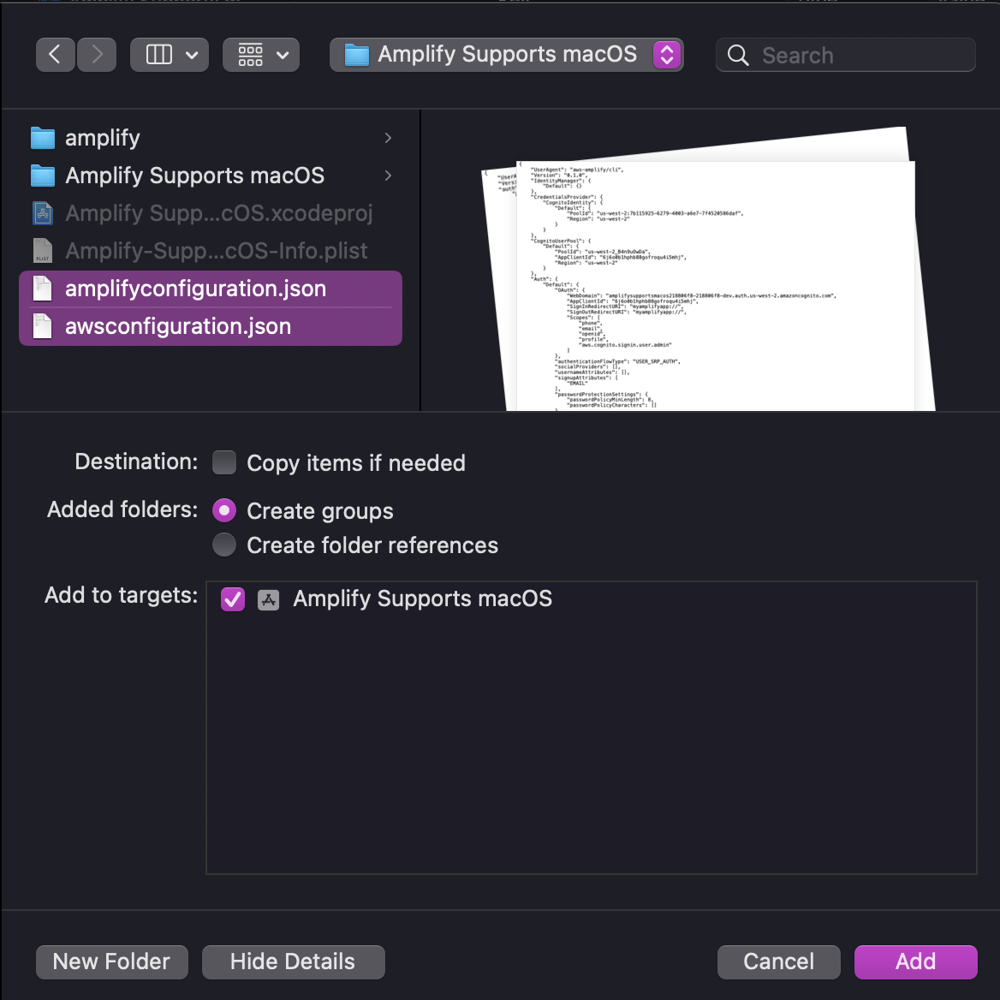

You should see both `amplifyconfiguration.json` and `awsconfiguration.json` listed in the Project Navigator:

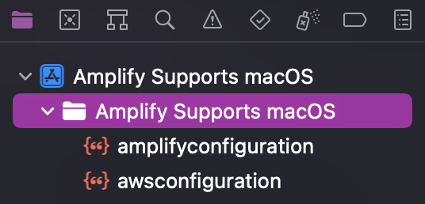

Open Xcode's package finder (`File > Add packages`) and enter in the Amplify Libraries for Swift GitHub repository url (`https://github.com/aws-amplify/amplify-swift`) and click **Add Package**:

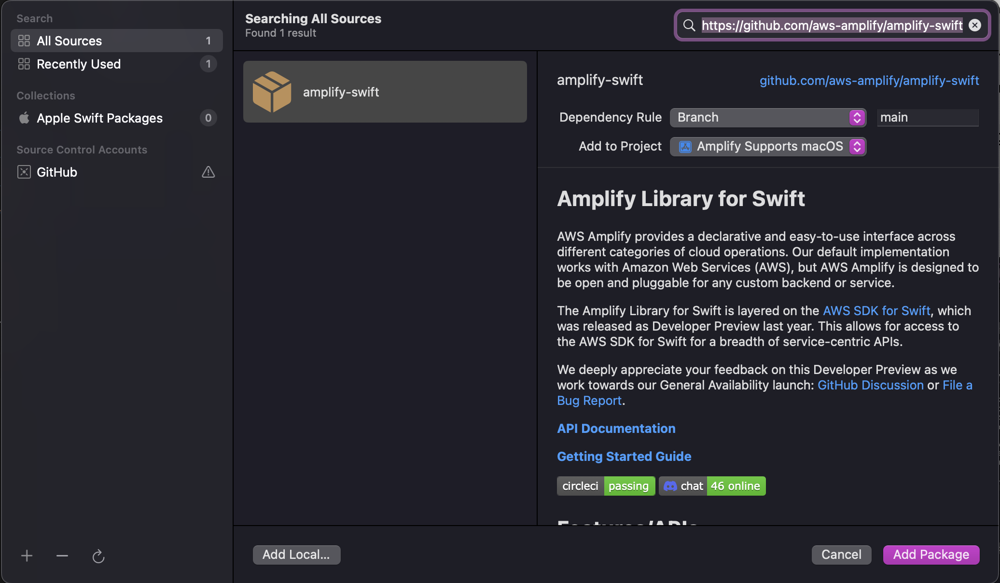

Select both **Amplify** and **AWSCognitoAuthPlugin** when prompted for the package products and click **Add Package**:

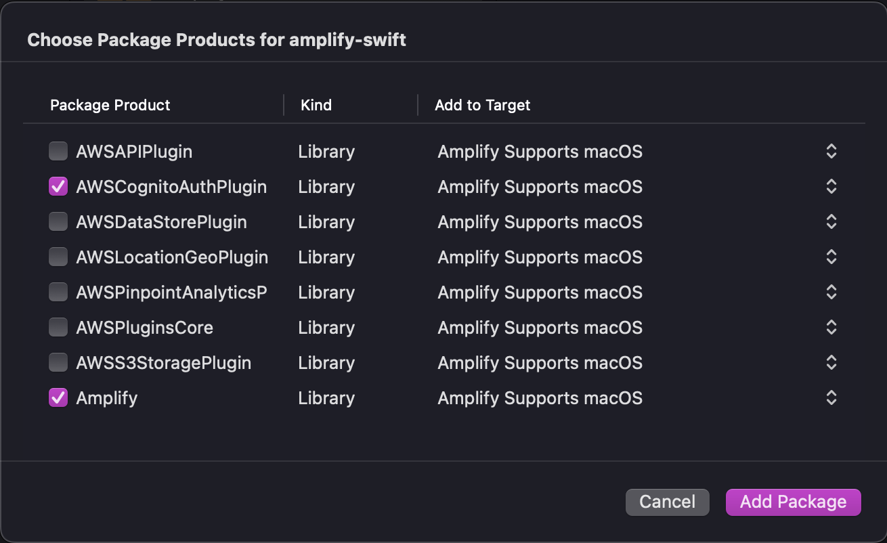

Navigate to `<YOUR_APP>App.swift` and replace its contents with the following code:

```swift
// 1
import Amplify
import AWSCognitoAuthPlugin
import SwiftUI

@main
struct <YOUR_APP>App: App {
    // 2
    init() {
        do {
            try Amplify.add(plugin: AWSCognitoAuthPlugin())
            try Amplify.configure()
            print("Amplify configured")
        } catch {
            print(error)
        }
    }
    
    var body: some Scene {
        WindowGroup {
            ContentView()
        }
    }
}
```

1. Include the necessary import statements for both `Amplify` and `AWSCognitoAuthPlugin`
2. Attempt to configure Amplify with the Auth plugin immediately when the app is initiated.

Build and run your project to ensure that you receive the following output in your Xcode logs:

```bash
Amplify configured
```

In `ContentView.swift` replace the contents with the following code:

```swift
import Amplify
import SwiftUI

struct ContentView: View {
    
    @State var username: String?
    
    var platform: String {
        #if os(macOS)
        return "macOS"
        #else
        return "iPhone"
        #endif
    }
    
    var body: some View {
        InitialView()
            .frame(maxWidth: .infinity, maxHeight: .infinity)
    }
    
    @ViewBuilder
    func InitialView() -> some View {
        if let username = self.username {
            Text("Welcome to \(platform) \(username)")
        } else {
            Button("Sign In") {}
        }
    }
}
```

The code in the snippet above creates a basic UI for the macOS app and displays two different views; one for when the user is signed out and the other for when a user is signed in.

To add the sign in with web UI functionality, add the following methods:

```swift
// 1
func updateSessionStatus() async {
    let user = try? await Amplify.Auth.getCurrentUser()
    self.username = user?.username
}

// 2
func getWindow() async -> AuthUIPresentationAnchor {
    #if os(macOS)
    return await MainActor.run {
        let window = NSApplication.shared.windows.first!
        return window
    }
    #elseif canImport(UIKit)
    let scene = await UIApplication.shared.connectedScenes.first!
    let windowSceneDelegate = await scene.delegate as! UIWindowSceneDelegate
    let window = await windowSceneDelegate.window!!
    return window
    #endif
}

// 3
func webSignIn() async {
    do {
        _ = try await Amplify.Auth.signInWithWebUI(
            presentationAnchor: getWindow()
        )
        await updateSessionStatus()
    } catch {
        print(error)
    }
}
```

1. `updateSessionStatus()` will attempt to get the current user from Auth and will update the `username` value if the user has already signed in. Providing a valid username will represent whether the user is signed in or not.
2. Web sign in requires a presentation anchor and `getWindow()` handles the case for both macOS and iOS.
3. `webSignIn()` calls `Auth.signInWithWebUI` then updates the session status by calling `updateSessionStatus()`.

Update the `action` block of the **Sign in** button to call `webSignIn()`:

```swift
... // } else {

Button("Sign In") {
    Task { await webSignIn() }
}

... // }
```

Build and run! You should now be able to sign up and create an account using the web UI.


To run the same app on iOS, add **iPhone** as a Supported Destination:

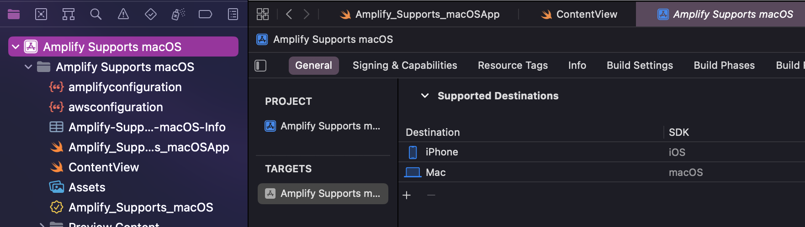

Build and run on an iPhone simulator and you will be able to sign in using the credentials used to sign up on macOS:

