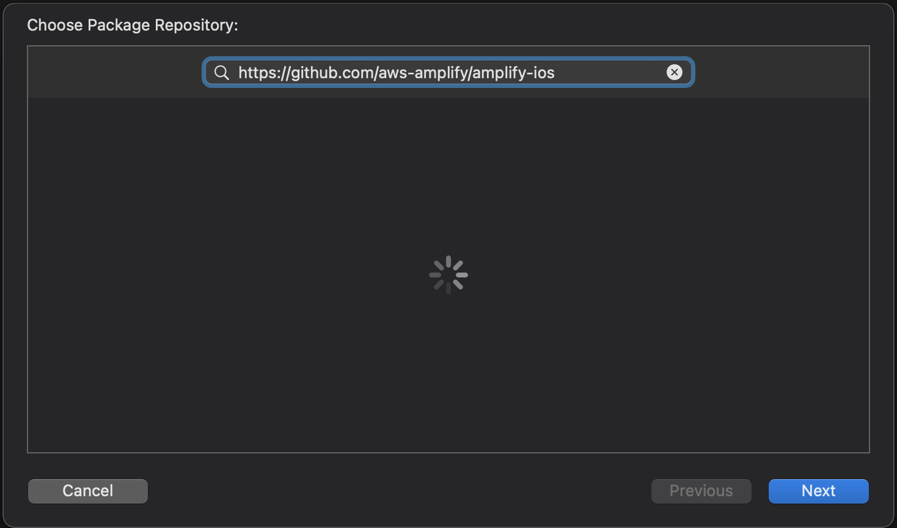
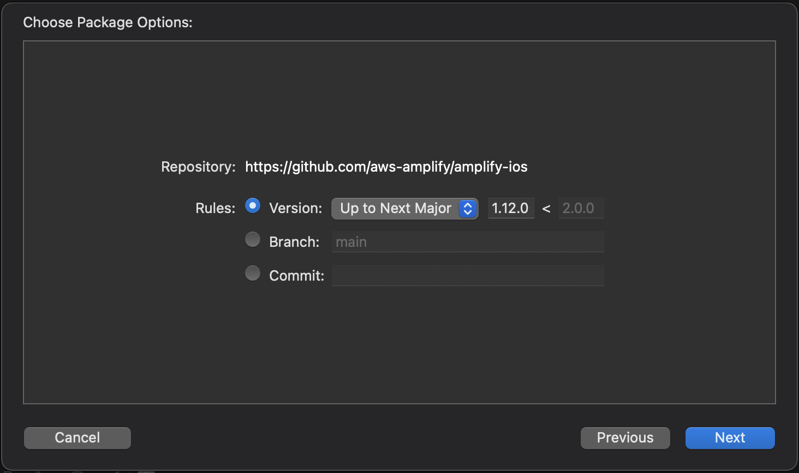
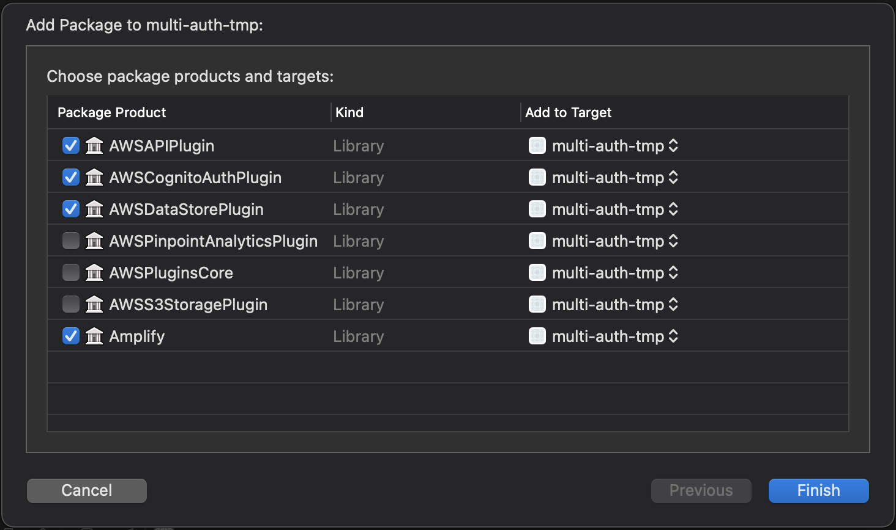

# Getting Started with AWS Amplify DataStore Multi-Auth for iOS

Managing which users have access to specific content is a problem that most modern apps face. With the recent release, AWS Amplify DataStore allows you to define multiple authorization (multi-auth) types for your GraphQL data schemas. Multi-auth types make it easier to manage user access and enable personalized content for users once they sign in.

This article will cover how to get up and running with multiple authorization types for Amplify DataStore so you can keep your users' data protected and offer a better experience in your iOS app.

## Prerequisites

To follow along, you should have the following prerequisites:

- iOS development experience
  - Logging to the Xcode console
  - Building simple UI
  - Handling user input
- An [AWS Account](https://portal.aws.amazon.com/billing/signup)
- Install Amplify CLI version 5.1.0 or later by running:
  ```bash
  $ curl -sL https://aws-amplify.github.io/amplify-cli/install | bash && $SHELL
  ```

## Configuring Amplify Categories

To create an Amplify app, run the following command at the root directory of your iOS project:

```bash
$ amplify init
```

Respond to the prompts with the following answers:

```
? Enter a name for the project: <YourProjectName>
? Initialize the project with the above configuration? Yes
? Select the authentication method you want to user: AWS Profile
? Please choose the profile you want to use: default
```

> I hit **Enter** for each of these prompts to select the default answer.

Next, add the API category by entering the following command:

```bash
$ amplify add api
```

Use the following answers so your project can be properly configured to support multi-auth:

```
? Please select from one of the below mentioned services: **GraphQL**
? Provide API name: **<YourApiName>**
? Choose the default authorization type for the API: **API key**
? Enter a description for the API key: **<YourDescription>**
? After how many days from now the API key should expire (1-365): **7**
? Do you want to configure advanced settings for the GraphQL API: **Yes, I want to make some additional changes.**
? Configure additional auth types: **Yes**
? Choose the additional authorization types you want to configure for the API: **Amazon Cognito User Pool**
? Do you want to use the default authentication and security configuration: **Default configuration**
? How do you want users to be able to sign in: **Username**
? Do you want to configure advanced settings: **No, I am done.**
? Enable conflict detection: **Yes**
? Select the default resolution strategy: **Auto Merge**
? Do you have an annotated GraphQL schema: **No**
? Choose a schema template: **Single object with fields**
? Do you want to edit the schema now: **Yes**
? Choose your default editor: **<YourFavoriteEditor>**
```

You have now set `API key` as the default authorization type and `Amazon Cognito User Pool` as the second authorization type. Since Cognito User Pools require a user to be authenticated, the Amplify Auth category was set up with the default configuration as well.

When prompted to edit the GraphQL schema, replace it with the following:

```graphql
type Post
  @model
  @auth(
    rules: [
      { allow: owner, provider: userPools, operations: [create, update, delete] },
      { allow: public, provider: apiKey, operations: [read] }
    ]
  ) {
  id: ID!
  content: String!
}
```

This simple `Post` object has two authentication rules:

1. a user authenticated with User Pools can create, update, and delete a `Post`
2. all other users, authenticated and unauthenticated, can read/query a `Post` using the API key

These rules would be common for social media and blogs which allow all users to view content, but only allow authenticated users to create, update, or delete their own posts.

With the Amplify app fully configured locally, it's time to push the app to the backend. Run the following command in the terminal:

```bash
$ amplify push -y
```

Lastly, to ensure that a `Post` model has been generated in Swift and added to your project, run the following:

```bash
$ amplify codegen models
```

## Implementing on iOS

The upcoming iOS implementation will be based on a basic SwiftUI app and will use logging to the console to explore the behavior of multi-auth.

### Adding Dependencies

Before using the Amplify Libraries, add them to the project using Swift Package Manager. In Xcode, select **File** > **Swift Packages** > **Add Package Dependency** and enter the Amplify iOS GitHub repo URL (`https://github.com/aws-amplify/amplify-ios`) into the search bar and click **Next**.



Select the most recent version of the Amplify iOS package and click **Next**.



Select AWSAPIPlugin, AWSCognitoAuthPlugin, and AWSDataStorePlugin as they are all required for using multi-auth. Then click **Finish**.



### Configuring Plugins

With the dependencies installed to the project, Amplify is ready to be configured in the app. In `<AppName>App.swift` add the following code:

```swift
import Amplify
import AWSAPIPlugin
import AWSCognitoAuthPlugin
import AWSDataStorePlugin
import SwiftUI

@main
struct YourAppNameApp: App {
    
    init() {
        configureAmplify()
    }
    
    var body: some Scene { ... }
    
    func configureAmplify() {
        do {
            // Add Auth Plugin
            try Amplify.add(plugin: AWSCognitoAuthPlugin())

            // Add API Plugin
            let models = AmplifyModels()
            try Amplify.add(plugin: AWSAPIPlugin(modelRegistration: models))

            // Add DataStore Plugin
            try Amplify.add(
                plugin: AWSDataStorePlugin(
                    modelRegistration: models,
                    configuration: .custom(authModeStrategy: .multiAuth)
                )
            )

            // Configure Amplify
            try Amplify.configure()
            print("Amplify Configured")
        } catch {
            print(error)
        }
    }
}
```

> If you're using a UIKit app, the configuration code will be the same, but you will call `configureAmplify()` in the `application:didFinishLaunchingWithOptions` method of the `AppDelegate`.

In `configureAmplify()` the code is the same as any other Amplify iOS project, the only difference is that the `AWSDataStorePlugin` is being configured with a custom configuration. Setting `authModeStrategy` to `.multiAuth` configures DataStore to synchronize data based on authorization priority.

> You can learn more about authorization priority at [Multiple authorization types priority order](https://docs.amplify.aws/lib/datastore/setup-auth-rules/q/platform/ios#multiple-authorization-types-priority-order).

### Functionality and UI

To test the capabilities and behaviors of multi-auth, make queries and mutations with authenticated and unauthenticated users. Since the default authentication and security configuration was selected during `$ amplify add api`, use the following methods to fetch the current auth session, sign up, verify sign up, sign in, and sign out:

```swift
func fetchAuthSession() {
    Amplify.Auth.fetchAuthSession { print($0) }
}

func signUp() {
    Amplify.Auth.signUp(
        username: username,
        password: password,
        options: .init(userAttributes: [.init(.email, value: email)]),
        listener: { print($0) }
    )
}

func confirmSignUp() {
    Amplify.Auth.confirmSignUp(
        for: username,
        confirmationCode: confirmationCode,
        listener: { print($0) }
    )
}

func signIn() {
    Amplify.Auth.signIn(
        username: username,
        password: password,
        listener: { print($0) }
    )
}

func signOut() {
    Amplify.Auth.signOut { print($0) }
}
```

Each method will be called on the tap of a button and the results of each process will be logged to the console. To create SwiftUI buttons for each of these methods, add the following code to the `body` property in `ContentView.swift`:

```swift
VStack(spacing: 40) {
    Button("Fetch Auth Session", action: fetchAuthSession)
    Button("Sign Up", action: signUp)
    TextField("Confirmation Code", text: $confirmationCode)
    Button("Confirm Sign Up", action: confirmSignUp)
    Button("Sign In", action: signIn)
    Button("Sign Out", action: signOut)
}
```

Note that there is also a confirmation code `TextField` in the UI so you can enter the verification code sent to the email. Creating an authenticated user can now be done without having to rebuild the app.

To test the create, query, and delete functionality of multi-auth with Amplify DataStore; add the following methods to the `ContentView`:

```swift
func queryPosts() {
    Amplify.DataStore.query(Post.self) { print($0) }
}

func createPost() {
    let newPost = Post(content: "My content \(Int.random(in: 0 ... 100))")
    Amplify.DataStore.save(newPost) { print($0) }
}

func deleteFirstPost() {
    Amplify.DataStore.query(Post.self) { result in
        guard
            let posts = try? result.get(),
            let firstPost = posts.first
        else { return }
        
        Amplify.DataStore.delete(firstPost) { print($0) }
    }
}
```

Each of these methods will log their respective results to the console, making it easy to see what `Post` objects are in the table by performing a query, or logging a successful creation or deletion of a `Post` object.

To connect these methods to buttons, add the following code to the same `VStack` as the authentication buttons:

```swift
Button("Query Posts", action: queryPosts)
Button("Create Post", action: createPost)
Button("Delete First Post", action: deleteFirstPost)
```

### Testing Multi-Auth

An authenticated user will be required to explore the different behaviors of the authorization types. Use the app to create an authenticated user and sign in. Once signed in, test the authorization rules of the `Post` model.

#### Authenticated User

To start, run a query on the `Post` table by tapping the **Query Post** button in the app. You will see the following:

```
success([])
```

As expected, nothing has been created, so the result is an empty array.

Next, tap **Create Post** twice, then **Query Post** to see the following output:

```
success([
  YourAppName.Post(
    id: "D99729B5-0B56-4DDD-A96C-74B7A8C9A783", 
    content: "My content 55", 
    createdAt: Optional(Amplify.Temporal.DateTime(foundationDate: 2021-07-09 15:42:42 +0000)), 
    updatedAt: Optional(Amplify.Temporal.DateTime(foundationDate: 2021-07-09 15:42:42 +0000))
  ), 
  YourAppName.Post(
    id: "AE8F6F49-1293-4189-8254-A401E6AF1B07", 
    content: "My content 66", 
    createdAt: Optional(Amplify.Temporal.DateTime(foundationDate: 2021-07-09 15:43:15 +0000)), 
    updatedAt: Optional(Amplify.Temporal.DateTime(foundationDate: 2021-07-09 15:43:15 +0000))
  )
])
```

Now there are two `Post` objects in the database.

The last authenticated test is to delete one of the posts. Tap **Delete First Post**, then **Query Post** to see the following result:

```
success([
  YourAppName.Post(
    id: "AE8F6F49-1293-4189-8254-A401E6AF1B07", 
    content: "My content 66", 
    createdAt: Optional(Amplify.Temporal.DateTime(foundationDate: 2021-07-09 15:43:15 +0000)), 
    updatedAt: Optional(Amplify.Temporal.DateTime(foundationDate: 2021-07-09 15:43:15 +0000))
  )
])
```

The first post has been deleted, so an array with a single `Post` is now returned.

To verify that the data has been created and deleted successfully, run the app again and tap **Query Posts** to make sure only one `Post` remains.

#### Unauthenticated User

Now that there is some data in the `Post` table, test the behavior of an unauthenticated user.

First, sign out by tapping **Sign Out**, then **Fetch Auth Session** to verify that you're no longer signed in. The output should indicate that you are no longer signed in:

```
...
There is no user signed in
...
```

Next, run the same tests as done for an authenticated user. Tap **Query Posts**. You will see the following output:

```
success([
  YourAppName.Post(
    id: "AE8F6F49-1293-4189-8254-A401E6AF1B07", 
    content: "My content 66", 
    createdAt: Optional(Amplify.Temporal.DateTime(foundationDate: 2021-07-09 15:43:15 +0000)), 
    updatedAt: Optional(Amplify.Temporal.DateTime(foundationDate: 2021-07-09 15:43:15 +0000))
  )
])
```

Since `Post` objects can be read by the public using `API key`, the `Post` from the authenticated user can be queried by the unauthenticated user.

Attempt to create a new `Post` object as an unauthenticated user by tapping **Create Post**, then **Query Posts**. Observe the following output:

```
success([
  YourAppName.Post(
    id: "AE8F6F49-1293-4189-8254-A401E6AF1B07", 
    content: "My content 66", 
    createdAt: Optional(Amplify.Temporal.DateTime(foundationDate: 2021-07-09 15:43:15 +0000)), 
    updatedAt: Optional(Amplify.Temporal.DateTime(foundationDate: 2021-07-09 15:43:15 +0000))
  ),
  YourAppName.Post(
    id: "D7A7FBB3-6B8C-4427-AE17-D57F42E426D3", 
    content: "My content 41", 
    createdAt: nil, 
    updatedAt: nil
  )
])
```

The unauthenticated user can still create `Post` objects and save them locally. The `Post` authorization rules only apply to synchronizing the data with the backend, not to CRUD (create, read, update, delete) operations locally.

Another difference you'll notice is that `createdAt` and `updatedAt` are `nil`. This is because the `createPost` method created a `Post` object with only the `content` argument passed to the initializer. If `createdAt` and `updatedAt` aren't provided values during initialization, they will only be updated when stored in the backend. Since this new object is not synced to the backend, those values remain `nil`.

The next test is deleting the first `Post`, which was created by the authenticated user. Tap **Delete First Post**, then **Query Posts** to get the following results:

```
success([
  YourAppName.Post(
    id: "D7A7FBB3-6B8C-4427-AE17-D57F42E426D3", 
    content: "My content 41", 
    createdAt: nil, 
    updatedAt: nil
  )
])
```

In the output above, there is only one `Post` being returned in the array, the one created by the unauthenticated user. As mentioned previously, CRUD operations will still work locally for unauthenticated users, but will not affect the backend data if the authorization rules do not allow the operation. This behavior can be useful for apps that allow unauthenticated users to have limited access while giving authenticated users the advantage of keeping data synchronized across app instances.

It's important to keep in mind that the local data from the unauthenticated user can end up being synced with the backend if the user signs in and starts performing CRUD operations. This can be beneficial for keeping the user experience consistent after authenticating. However, if this is not the desired user experience, performing `Amplify.DataStore.clear()` and `Amplify.DataStore.start()` during sign in and sign out will clear the local database.

## Clean Up

Now that you have finished testing multiple authorization types with Amplify DataStore, it's recommended that you delete your Amplify app if you aren't going to use it anymore. This ensures that your resources won't be abused in the event someone gains access to your project's credentials.

To delete all the local Amplify associated files and the Amplify project in the backend, run the following command:

```bash
$ amplify delete
```

> This action cannot be undone. Once the project is deleted, you cannot recover it and will have to reconfigure the categories and the project configuration files if you need to use the project again.

## Conclusion

Now you know how to configure and use multiple authorization types with Amplify DataStore on iOS. To learn more about different authorization scenarios, check out [Setup authorization rules](https://docs.amplify.aws/lib/datastore/setup-auth-rules/q/platform/ios). If you have additional ideas to improve the experience of using Amplify for iOS, [please leave us a feature request on GitHub](https://github.com/aws-amplify/amplify-ios/issues/new), or come [chat with us on Discord](https://discord.gg/amplify).