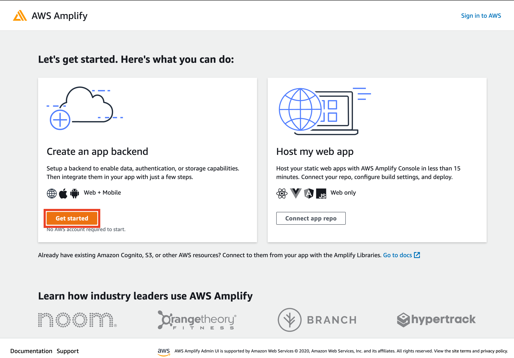

# Rapid iOS App Prototyping with Amplify Admin UI and SwiftUI

AWS Amplify now offers a new way to model your app's data schemas that is easier than ever. The new Admin UI feature provides an easy-to-use interface where you can layout the models of your app, create relationships between them, and pull the Swift representation of those models into your codebase.

In this post, you will be using the Admin UI to prototype a room booking app that allows a user to sign in, view seeded available rooms, book one of those rooms, and see the bookings associated with that user. Since this is a prototype, we will be focusing on building the concept of the app and feign other features like authenticating the user and storing photos.

This tutorial will show you how to configure the models required for the prototype and start using them in a native iOS app built in SwiftUI.


## Topics we'll be covering

1. Data modeling with Amplify Admin UI
2. Configuring Amplify in a native iOS app
3. Implement prototype functionality with the generated models


### Prerequisites

1. Install [Xcode](https://developer.apple.com/xcode/downloads/) version 12.2 or later
2. Install [CocoaPods](https://cocoapods.org/)
3. Sign up for an [AWS account](https://portal.aws.amazon.com/billing/signup?redirect_url=https%3A%2F%2Faws.amazon.com%2Fregistration-confirmation#/start)
4. Install the Amplify CLI

```shell
curl -sL https://aws-amplify.github.io/amplify-cli/install | bash && $SHELL
```


## Data modeling

Start off by heading over to https://sandbox.amplifyapp.com and clicking the "Get started" button under "Create an app backend".



Choose "Data" as the feature to setup, select "Blank schema", and click "Create new schema".


Now that we have a blank data modeling canvas, we can start adding our models.

The prototype will allow different users to "sign in" by simpling providing a username. Let's add a `User` model that will simply have an `id` and `username`.


With the `username` field selected, select the "Is required" box on the right side of the screen.

Once the user is "signed in", the first screen they will see is a list of rooms that are available to be booked. Add a `Room` model.


Each of the properties for our `Room` object will be required, so you will need to select the checkbox for each of the fields. 

We also get to see that these schemas can support a lot of different types when we switch the type of `price` to `Int`.


Each of these properties will be represented by either a native Swift type or a type provided by the Amplify libraries, making our feature implementation feel native to the codebase.

Lastly, we need to create an object that represents the booking of a room by the user. Our app will show the user a list of their `Booking`'s which will include the data of the `Room` itself. To keep each `Booking` up to date with the assocaited `Room`, we will establish a one-to-one relationship in our schema.


Each of the properties on the `Booking` object will be required, including the relationship to the `Room`.

Now that the data scema of our app is complete, navigate to the "Deploy" tab and log in to or sign up for an AWS Account. 

Once you're signed in, you will be properted to create your app's backend.


Enter an app name, select an AWS region, and click deploy. Amplify will begin creating our backend environment and prep all the resources to start using our models.

After a few minutes, you will see that the Amplify app has been created. Open the Admin UI to see an overview of the staging environment created for us.


Navigate to the "Data" section, and you will see that our model schemas have been added to this Amplify app.


At this point, I'd recommend that you review the schemas for typos, correct property type, and/or properties being marked as "Is required".

Next, click "Local setup instructions". You will be presented with a popup containing the terminal command to pull down your Amplify project, as well as code snippets on how to initialize our model object in Swift code.


## Configuring Amplify Locally

Now it's time to open up Xcode and create a new project for our app.


Once the Xcode project is created, open the terminal, navigate to the root of the Xcode project and run the command provided in the "Local setup instructions" of the Admin UI. It should look something like this:

```shell
amplify pull --appId xxxxxxxxxxxxxx --envName staging
```

If you run `$ ls` at the root of your Xcode project, you should now see an `amplify` folder as well as two configuration files: `amplifyconfiguration.json` and `awsconfiguration.json`. We will need to add the configuration files and the generated models inside the `amplify` folder to our Xcode project.

In the navigation pane of Xcode, right click the source code folder and select "Add files to project"


Add both configuration files and the generated models folder at `path/to/project/amplify/generated/models`. The navigation pane will now look like this:


All our files are ready and in place. Now we need to add the Amplify Libraries to our project by installing them with CocoaPods.

At the root of your Xcode project, run the following:

```shell
pod init && open Podfile
```

Replace the contents of the Podfile with this:

```ruby
platform :ios, '14.0'

target 'room-booking' do
  use_frameworks!

  pod 'Amplify'
  pod 'AmplifyPlugins/AWSAPIPlugin'
  pod 'AmplifyPlugins/AWSDataStorePlugin'
end
```

We are specifying that the platform is iOS 14 and that we will be adding three pods: Amplify, the API plugin, and the DataStore plugin.

Save the file and install the dependencies at the root of the Xcode project:

```shell
pod install --repo-update
```

After the installation is complete, open the `*.xcworkspace` file.

```shell
xed .
```

> The `*.xcodeproj` needs to be closed so the workspace will automatically be opened or else it will appear as if the Xcode project is missing files.

In Xcode, navigate to the `*App.swift` file where the `@main` struct is implemented. This is where we will configure the Amplify Libraries.

At the top add the following import statements:

```swift
import Amplify
import AmplifyPlugins
```

Now in the App struct itself, add a `configureAmplify()` function:

```swift
... // body closing }

func configureAmplify() {
    let dataStorePlugin = AWSDataStorePlugin(modelRegistration: AmplifyModels())
    let apiPlugin = AWSAPIPlugin(modelRegistration: AmplifyModels())
    do {
        try Amplify.add(plugin: dataStorePlugin)
        try Amplify.add(plugin: apiPlugin)
        try Amplify.configure()
        print("Initialized Amplify")
    } catch {
        print("Could not initialize Amplify: \(error)")
    }
}

... // *App closing }
```

Call `configureAmplify()` in the `init` method of the `*App` object.

```swift
... // struct *App: App {

init() {
    configureAmplify()
}

... // var body: some Scene {
```

Run the app and you should see "Initialized Amplify" printed to your logs.


## Implement Prototype Functionality

You're now completely done setting up a backend that will support scalable, live data; giving you more time to focus on the app's functionality. 

The first screen of the room booking prototype will be the "login" screen. Here, a user will simply enter a username and tap a button to login.

Create a new file called `LoginView.swift` and add the following:

```swift
// 1
import Amplify
import SwiftUI

struct LoginView: View {
    
    // 2
    @StateObject var viewModel = ViewModel()
    
    // 3
    let onLogin: (User) -> Void
    
    var body: some View {
        VStack {
            TextField("Username", text: $viewModel.username)
                .padding()
                .background(Color(.secondarySystemBackground))
                .clipShape(Capsule())
                .padding(.horizontal, 40)
            
            Button("Login") {
                // 4
                viewModel.login(completion: onLogin)
            }
            .padding()
            .foregroundColor(.white)
            .background(Color.purple)
            .clipShape(Capsule())
        }
    }
}

extension LoginView {
    class ViewModel: ObservableObject {
        @Published var username = String()
        
        // 5
        func login(completion: @escaping (User) -> Void) {
            
        }
    }
}
```

1. We will be using `Amplify` in our `ViewModel` to handle the "login" logic.
2. The `ViewModel` is responsible for the state of our view. We are using an instance of a `ViewModel` class that is scoped to the `LoginView` through an `extension`
3. This view is responsible for sending the "logged in" `User` back up the chain. This is done with a closure that will be implemented back in the `*App.swift` file.
4. When the "Login" button is tapped, it will run `ViewModel.login`. The `onLogin` closure is passed as an argument to send the `User` up the chain.
5. The `login` method is where we will implement the our Amplify related logic.

The `LoginView` should now appear like this in the preview area:


The prototype will only require a username to login. To make it so a user can have bookings associated with their account, we will create a `User` object for each username entered into the field. If the username has already been used, we can simply return the existing `User` so they can log back in.

In order to simply this process, we will be making the `id` and `username` the same value when creating a `User`. This makes it easier to query a `User` by id.

Add the following to `ViewModel.login`:

```swift
... // func login(completion: @escaping (User) -> Void) {

// 1
Amplify.DataStore.query(User.self, byId: username) { result in

    if let queriedUser = try? result.get() {
        print("queried user", queriedUser)
        completion(queriedUser)

    } else {
    
        // 2
        let newUser = User(id: username, username: username)
        Amplify.DataStore.save(newUser) { result in
            do {
                let savedUser = try result.get()
                print("saved user", savedUser)
                completion(savedUser)

            } catch {
                print(error)
            }
        }
    }
}

... // login closing }
```

1. Run a query to see if the `User` already exists and pass the queried `User` to the `completion` closure.
2. If the `User` doesn't exist, create that `User` and send it through `completion`.

Back in `*App.swift`, make the `LoginView` the main view in the `body`:

```swift
... // WindowGroup {

LoginView { user in
    sessionManager.currentUser = user
}

... // WindowGroup closing }
```

This will initialize the `LoginView` with a closure where the provided `User` is passed to a `SessionManager` object.

In a new file `SessionManager.swift`, add this code:

```swift
class SessionManager: ObservableObject {
    @Published var currentUser: User?
}
```

This object will be responsible managing the logged in `User`.

Back in `*App.swift`, create an observed instance of `SessionManager`.

```swift
... // struct room_bookingApp: App {

@ObservedObject var sessionManager = SessionManager()

... // init() {
```

Once the user has "logged in", they will be presented with multiple room listings. They would also be able to tab over to their bookings where a similar listing would be displayed, but would include their booking dates.

Let's create a view that can be used to show the details of available rooms as well as booked rooms in a file called `RoomItemView.swift`:

```swift
import SwiftUI

struct RoomItemView: View {
    
    let room: Room
    // 1
    let bookingDates: (checkInDate: Date, checkOutDate: Date)?
    
    // 2
    var bookingDescription: String? {
        guard let bookingDates = self.bookingDates else { return nil }
        let formatter = DateFormatter()
        formatter.dateStyle = .short
        formatter.timeStyle = .none
        
        let checkIn = formatter.string(from: bookingDates.checkInDate)
        let checkOut = formatter.string(from: bookingDates.checkOutDate)
        
        return "Booked from \(checkIn) to \(checkOut)"
    }
    
    var body: some View {
        VStack(alignment: .leading) {
            Image(room.imageKey)
                .resizable()
                .aspectRatio(contentMode: .fill)
                .frame(width: .infinity, height: 250)
                .background(Color.gray)
                .cornerRadius(10)
                
            Text("\(room.description) - \(room.city)")
                .font(.title3)
            
            // 3
            if let bookingDescription = self.bookingDescription {
                Text(bookingDescription)
            } else {
                Text("$\(room.price)").bold()
                    + Text(" / night")
            }
            
        }
    }
}
```

1. By allowing `bookingDates` to be optional, `RoomItemView` can be used for both listings and bookings.
2. The `bookingDescription` will format the `bookingDates` tuple into a human readable description of the booked dates.
3. If a `bookingDescription` can be generated, then it will be displayed. If not, we assume the view is presented in the context of a listing and should display the price per night.


Next, create `RoomsView.swift` as the view responsible for showing the room listings.

```swift
import Amplify
import SwiftUI

struct RoomsView: View {
    
    @StateObject var viewModel = ViewModel()
    
    var body: some View {
        NavigationView {
            ScrollView {
                LazyVStack {
                    // 1
                    ForEach(viewModel.rooms) { room in
                        NavigationLink(
                            // 2
                            destination: RoomDetailsView(room: room),
                            label: { RoomItemView(room: room, bookingDates: nil) }
                        )
                        .accentColor(Color(.label))
                        .padding()
                    }
                }
            }
            .navigationTitle("Rooms")
        }
        // 3
        .onAppear(perform: viewModel.getRooms)
    }
}

extension RoomsView {
    class ViewModel: ObservableObject {
        @Published var rooms = [Room]()
        
        // 4
        func getRooms() {
            
        }
    }
}
```

1. We'll loop over each of the `Room` objects provided by the `ViewModel` and pass them into the destination and label. There will be an error presented since `Room` doesn't conform to `Identifiable` at the moment.
2. The destination will be a `RoomDetailsView` that we will be implementing next.
3. Whenever the `RoomView` appears, we will query the database for the latest `Room` objects.
4. `getRooms()` will be responsible for querying DataStore for all the `Room`'s.


Let's implement the functionality of `getRooms()`:

```swift
... // func getRooms() {

Amplify.DataStore.query(Room.self) { result in
    do {
        let rooms = try result.get()
        print(rooms)
        DispatchQueue.main.async { [weak self] in
            self?.rooms = rooms
        }
    } catch {
        print(error)
    }
}

... // getRooms closing  }
```

This is as simple as querying the `Room`'s and updating the `ViewModel` with whatever comes back.

There are two errors we need to resolve at this point, `Room` needs to conform to `Identifiable` and `RoomDetailsView` needs to be implemented.

In a new file named `Room+Extensions.swift` add the following:

```swift
import Foundation

extension Room: Identifiable {}
```

Any extensions on generated objects should take place in a seperate file so the changes aren't overwritten when updating any model schemas in the future.

Add the following to a new file named `RoomDetailsView.swift`:

```swift
import Amplify
import SwiftUI

struct RoomDetailsView: View {
    
    @Environment(\.presentationMode) var presentationMode
    // 1
    @EnvironmentObject var sessionManager: SessionManager
    @StateObject var viewModel = ViewModel()
    
    let room: Room
    
    // 2
    var currentUser: User? {
        sessionManager.currentUser
    }
    
    var body: some View {
        VStack {
            Image(room.imageKey)
                .resizable()
                .aspectRatio(contentMode: .fill)
                .frame(height: 250)
                
            VStack(alignment: .leading) {
            
                Text(room.description)
                    .font(.title)
                
                Text(room.city)
                    .font(.title3)
                
                Spacer()
                
                DatePicker("Check In", selection: $viewModel.checkInDate, displayedComponents: .date)
                
                DatePicker("Check Out", selection: $viewModel.checkOutDate, displayedComponents: .date)
                
                Button("Book for $\(room.price)") {
                    guard let currentUser = self.currentUser else { return }
                    viewModel.book(room, for: currentUser)
                    presentationMode.wrappedValue.dismiss()
                }
                .frame(maxWidth: .infinity)
                .padding()
                .foregroundColor(.white)
                .background(Color.purple)
                .clipShape(Capsule())
                .padding(.vertical)
            }
            .padding()
        }
        .navigationBarTitle("Details", displayMode: .inline)
    }
}

extension RoomDetailsView {
    class ViewModel: ObservableObject {
        
        @Published var checkInDate: Date = Calendar.current.date(
            byAdding: .day,
            value: 1,
            to: Date()
        )!
        
        @Published var checkOutDate = Calendar.current.date(
            byAdding: .day,
            value: 2,
            to: Date()
        )!
        
        // 3
        func book(_ room: Room, for user: User) {
            
        }
    }
}
```

1. `RoomDetailsView` will be passed the instance of the `SessionManager` created in the `*App` object as an `EnvironmentObject`.
2. The `SessionManager` provides the `currentUser` which can be used to book a `Room`.
3. The `book(_:for:)` method will be responsible for booking a `Room` for a specified `User`.


To book a room, we will create a new `Booking` instance and save it to DataStore. Update the `book(_:for:)` method.

```swift
... // func book(_ room: Room, for user: User) {

let booking = Booking(
    room: room,
    guestId: user.id,
    checkInDate: Temporal.Date(checkInDate),
    checkOutDate: Temporal.Date(checkOutDate)
)

Amplify.DataStore.save(booking) { result in
    do {
        let savedBooking = try result.get()
        print("booked", savedBooking)
        
    } catch {
        print(error)
    }
}

... // book(_:for:) closing }
```

The only view we're missing is `MyBookingsView` which will be responsible for showing the user the different `Room`'s they booked and for which dates.

```swift
import Amplify
import SwiftUI

struct MyBookingsView: View {
    
    @EnvironmentObject var sessionManager: SessionManager
    @StateObject var viewModel = ViewModel()
    
    var currentUser: User? {
        sessionManager.currentUser
    }
    
    var body: some View {
        NavigationView {
            ScrollView {
                LazyVStack {
                    // 1
                    ForEach(viewModel.bookings) { booking in
                        RoomItemView(
                            room: booking.room,
                            // 2
                            bookingDates: booking.bookingDates
                        )
                    }
                }
                .padding(.horizontal)
            }
            .navigationTitle("My Bookings")
        }
        // 3
        .onAppear {
            guard let currentUser = self.currentUser else { return }
            viewModel.getBookings(for: currentUser)
        }
    }
}

extension MyBookingsView {
    class ViewModel: ObservableObject {
        @Published var bookings = [Booking]()
        
        func getBookings(for user: User) {

        }
    }
}
```

1. We will display a `RoomItemView` for each `Booking` provided by the `ViewModel`. Similar to `Room`, `Booking` will need to conform to `Identifiable` to be used by `ForEach`.
2. `Booking` also doesn't have a property called `bookingDates` which is a tuple of the `checkInDate` and `checkOutDate`.
3. Every time `MyBookingsView` appears, we will query DataStore for the latest `Booking`'s for the current user.


`MyBookingsView` is simply showing `RoomItemView`'s the same way `RoomsView` is; however, we need to provide the `Room` from a booking that is associated with the current user and not queried directly on `Room` itself. To accomplish getting the list of `Room`'s, we must perform a query on `Booking` where the `guestId` matches the current user ID.

Add the following to `getBookings(for:)`:

```swift
let booking = Booking.keys
            
Amplify.DataStore.query(
    Booking.self,
    where: booking.guestId == user.id,
    sort: .ascending(booking.checkInDate)
) { result in
    do {
        let bookings = try result.get()
        print("bookings", bookings)
        DispatchQueue.main.async { [weak self] in
            self?.bookings = bookings
        }
    } catch {
        print(error)
    }
}
```

This query provides a predicate that specifies that `booking.guestId` matches `user.id` and all results that come back should be sorted in ascending order based on the check in date. Then we update the `bookings` of the `ViewModel` so the list can be shown in the view.

With that last view out of the way, we can update the `*App` object to handle a user logging in and selecting a tab. Add this to the `body` in `*App.swift`:

```swift
... // WindowGroup {

if sessionManager.currentUser != nil {
    TabView {
        RoomsView()
            .tabItem { Image(systemName: "list.bullet.below.rectangle") }
        
        MyBookingsView()
            .tabItem { Image(systemName: "calendar") }
    }
    .environmentObject(sessionManager)
    
} else {
    LoginView { user in
        sessionManager.currentUser = user
    }
}

... // WindowGroup closing }
```

When a `User` is provided by `LoginView`, the user will be displayed a tabbed view of available rooms and their bookings. Everything is all setup and ready to work, the problem right now is that there aren't any `Room`'s to display or book. Since this is a prototype, we can simply seed some `Room`'s into our backend.

In a file called `DataSeeder.swift` create a method that will seed some `Room`'s into DataStore.

```swift
import Amplify
import SwiftUI

class DataSeeder {
    static func seedRooms() {
        let seededRooms: [Room] = [
            Room(
                description: "One king size bed",
                city: "Los Angeles",
                price: 100,
                imageKey: "stockphoto-1"
            ),
            Room(
                description: "Two full sized beds",
                city: "Pasadena",
                price: 64,
                imageKey: "stockphoto-2"
            ),
            Room(
                description: "Whole studio apartment",
                city: "El Segundo",
                price: 120,
                imageKey: "stockphoto-3"
            ),
        ]
        
        seededRooms.forEach { room in
            Amplify.DataStore.save(room) { print("seeded", $0) }
        }
    }
}
```

Back in `*App.swift`, create a function that will check if there are any `Room`'s already saved; if not, seed those `Room`'s.

```swift
func seedRoomsIfNeeded() {
    Amplify.DataStore.query(Room.self) { result in
        guard (try? result.get().isEmpty) == true else { return }
        DataSeeder.seedRooms()
    }
}
```

Now call that method in the `*App` initializer:

```swift
... // configureAmplify()

seedRoomsIfNeeded()

... // init closing }
```

Now if you run the app, you should be able to "login", view rooms as well as their details, book a room, and see the rooms booked by that account.


## Conclusion

AWS Amplify is a powerful toolset that makes life easier for developers; whether that means building out a quick prototype, like we did here, or creating a large app with thousands of users. The new Admin UI makes it easier to visualize your model schema and create connections between different objects, saving time by making connections between objects more apparent and easy to understand. All of this shortens the time to get the backend configured and spend more time on the client facing app.

This was just a glimpse of what is possible with Amplify Admin UI; there's still Authentication, Storage, Predictions, and much more that can be managed with the new interface. It looks like prototyping apps is only going to get easier from here 🚀