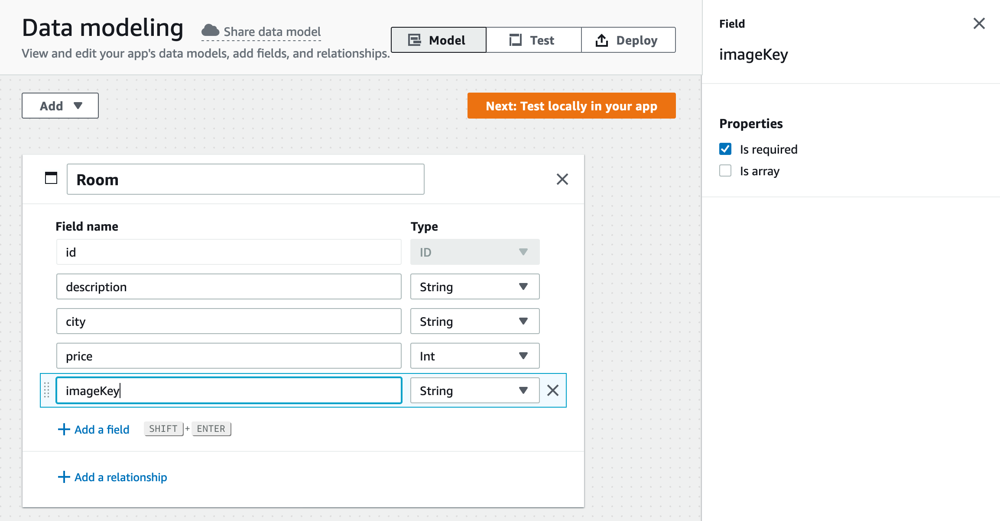

# Rapid iOS App Prototyping with Amplify Admin UI and SwiftUI

AWS Amplify now offers a new way to model your app's data schemas that is easier than ever. The new Admin UI feature provides an easy-to-use interface where you can layout the models of your app, create relationships between them, and pull the Swift representation of those models into your codebase.

In this post, you will be using the Admin UI to prototype a room booking app that allows a user to sign in, view seeded available rooms, book one of those rooms, and see the bookings associated with that user. Since this is a prototype, we will be focusing on building the concept of the app and feign other features like authenticating the user and storing photos.

This tutorial will show you how to configure the models required for the prototype and start using them in a native iOS app built in SwiftUI.


## Topics we'll be covering

1. Data modeling with Amplify Admin UI
2. Configuring Amplify in a native iOS app
3. Implement prototype functionality with the generated models


### Prerequisites

1. Install [Xcode](https://developer.apple.com/xcode/downloads/) version 12.2 or later
2. Install [CocoaPods](https://cocoapods.org/)
3. Sign up for an [AWS account](https://portal.aws.amazon.com/billing/signup?redirect_url=https%3A%2F%2Faws.amazon.com%2Fregistration-confirmation#/start)
4. Install the Amplify CLI

```shell
curl -sL https://aws-amplify.github.io/amplify-cli/install | bash && $SHELL
```


## Data modeling

Start off by heading over to https://sandbox.amplifyapp.com and clicking the "Get started" button under "Create an app backend".


Choose "Data" as the feature to setup, select "Blank schema", and click "Create new schema".


Now that we have a blank data modeling canvas, we can start adding our models.

The prototype will allow different users to "sign in" by simpling providing a username. Let's add a `User` model that will simply have an `id` and `username`.


With the `username` field selected, select the "Is required" box on the right side of the screen.

Once the user is "signed in", the first screen they will see is a list of rooms that are available to be booked. Add a `Room` model.



Each of the properties for our `Room` object will be required, so you will need to select the checkbox for each of the fields. 

We also get to see that these schemas can support a lot of different types when we switch the type of `price` to `Int`.


Each of these properties will be represented by either a native Swift type or a type provided by the Amplify libraries, making our feature implementation feel native to the codebase.

Lastly, we need to create an object that represents the booking of a room by the user. Our app will show the user a list of their `Booking`'s which will include the data of the `Room` itself. To keep each `Booking` up to date with the assocaited `Room`, we will establish a one-to-one relationship in our schema.


Each of the properties on the `Booking` object will be required, including the relationship to the `Room`.

Now that the data scema of our app is complete, navigate to the "Deploy" tab and log in to or sign up for an AWS Account. 

Once you're signed in, you will be properted to create your app's backend.


Enter an app name, select an AWS region, and click deploy. Amplify will begin creating our backend environment and prep all the resources to start using our models.

After a few minutes, you will see that the Amplify app has been created. Open the Admin UI to see an overview of the staging environment created for us.


Navigate to the "Data" section, and you will see that our model schemas have been added to this Amplify app.


At this point, I'd recommend that you review the schemas for typos, correct property type, and/or properties being marked as "Is required".

Next, click "Local setup instructions". You will be presented with a popup containing the terminal command to pull down your Amplify project, as well as code snippets on how to initialize our model object in Swift code.


## Configuring Amplify Locally

Now it's time to open up Xcode and create a new project for our app.


Once the Xcode project is created, open the terminal, navigate to the root of the Xcode project and run the command provided in the "Local setup instructions" of the Admin UI. It should look something like this:

```shell
amplify pull --appId xxxxxxxxxxxxxx --envName staging
```

If you run `$ ls` at the root of your Xcode project, you should now see an `amplify` folder as well as two configuration files: `amplifyconfiguration.json` and `awsconfiguration.json`. We will need to add the configuration files and the generated models inside the `amplify` folder to our Xcode project.

In the navigation pane of Xcode, right click the source code folder and select "Add files to project"


Add both configuration files and the generated models folder at `path/to/project/amplify/generated/models`. The navigation pane will now look like this:


All our files are ready and in place. Now we need to add the Amplify Libraries to our project by installing them with CocoaPods.

At the root of your Xcode project, run the following:

```shell
pod init && open Podfile
```

Replace the contents of the Podfile with this:

```ruby
platform :ios, '14.0'

target 'room-booking' do
  use_frameworks!

  pod 'Amplify'
  pod 'AmplifyPlugins/AWSAPIPlugin'
  pod 'AmplifyPlugins/AWSDataStorePlugin'
end
```

We are specifying that the platform is iOS 14 and that we will be adding three pods: Amplify, the API plugin, and the DataStore plugin.

Save the file and install the dependencies at the root of the Xcode project:

```shell
pod install --repo-update
```

After the installation is complete, open the `*.xcworkspace` file.

```shell
xed .
```

> The `*.xcodeproj` needs to be closed so the workspace will automatically be opened or else it will appear as if the Xcode project is missing files.

In Xcode, navigate to the `*App.swift` file where the `@main` struct is implemented. This is where we will configure the Amplify Libraries.

At the top add the following import statements:

```swift
import Amplify
import AmplifyPlugins
```

Now in the App struct itself, add a `configureAmplify()` function:

```swift
... // body closing }

func configureAmplify() {
    let dataStorePlugin = AWSDataStorePlugin(modelRegistration: AmplifyModels())
    let apiPlugin = AWSAPIPlugin(modelRegistration: AmplifyModels())
    do {
        try Amplify.add(plugin: dataStorePlugin)
        try Amplify.add(plugin: apiPlugin)
        try Amplify.configure()
        print("Initialized Amplify")
    } catch {
        print("Could not initialize Amplify: \(error)")
    }
}

... // *App closing }
```

Call `configureAmplify()` in the `init` method of the `*App` object.

```swift
... // struct *App: App {

init() {
  configureAmplify()
}

... // var body: some Scene {
```

Run the app and you should see "Initialized Amplify" printed to your logs.


## Implement Prototype Functionality


