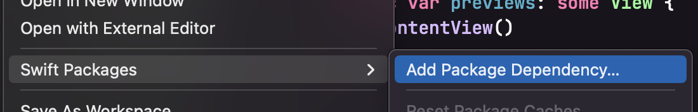
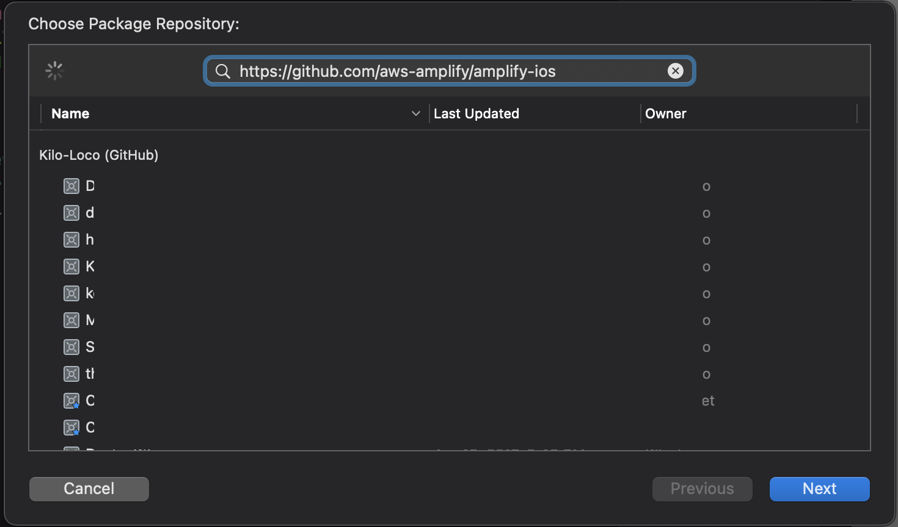
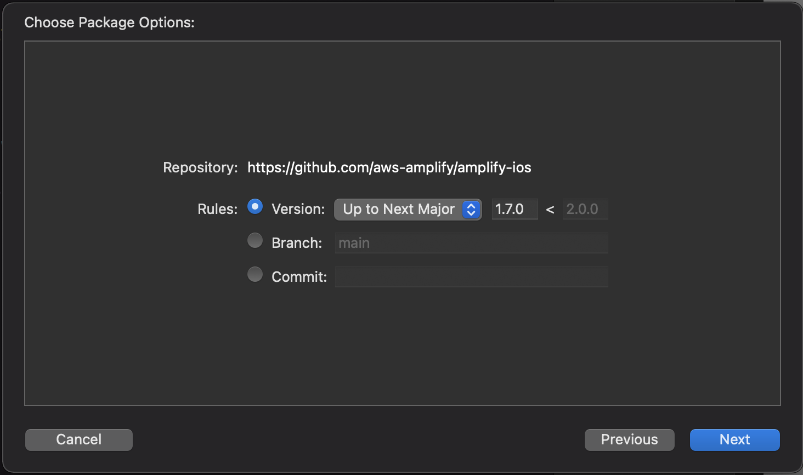
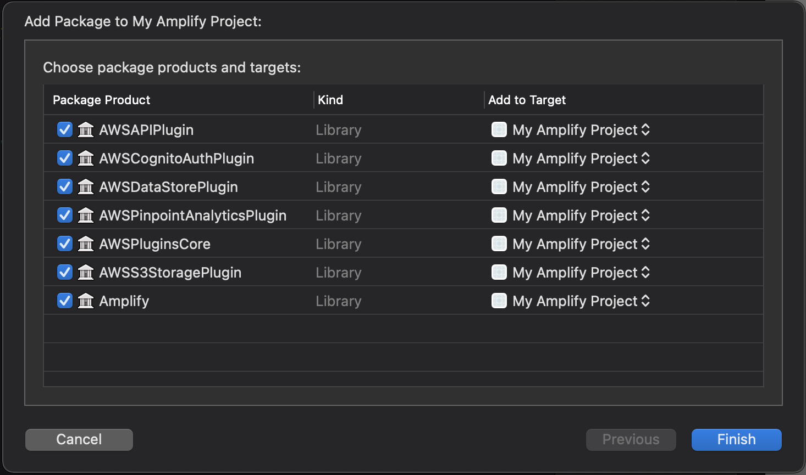
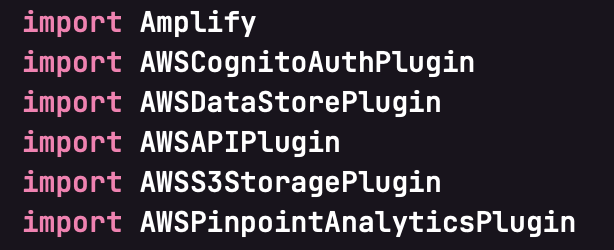

# Swift Package Manager Support for Amplify

Up until now, if you wanted to use AWS Amplify in your iOS app, you would have to install the Amplify Libraries using CocoaPods. Being the most popular dependency manager used for iOS projects written in Objective-C and/or Swift for nearly a decade, it was an absolute requirement to allow Amplify to be installed into an iOS project using CocoaPods.

Today, the AWS Amplify team is happy to announce support for the latest, first-party, dependency installer: Swift Package Manager.

## What is Swift Package Manager?

Swift Package Manager, commonly referred to as SPM in the iOS community, is an open-sourced tool released by Apple in 2017 that automates the process of downloading and installing dependencies written in Swift. It uses modules to break code up into smaller pieces, giving developers the ability to use only the smaller pieces of the package that are relevant to their project.

AWS Amplify offers many different categories to choose from and takes advantage of SPM's modular approach to allow developers to install only ther categories needed for the project.

## Adding Amplify Categories with SPM

All active iOS developers should have access to Swift Package manager as it is included with Xcode and/or Swift 3.0 and above. To follow along, you will need to have [Xcode 11](https://developer.apple.com/xcode/) or higher installed on a device running macOS.

To start adding the Amplify Libraries to your iOS project, start by opening your project in Xcode and select "Add Package Dependency..." (File > Swift Packages > Add Package Dependency).



Enter the Amplify iOS GitHub repo URL (`https://github.com/aws-amplify/amplify-ios`) into the search bar and click Next.



You should now be presented with the Options. You'll see the Amplify iOS repository the rules for which version of the dependencies you want to install.

Choose the first rule, version, as it will use the latest version of the dependency that can be detected from the `main` branch, then click Next.



Lastly, choose which of the libraries you want added to your project, but make sure that both `Amplify` and `AWSPluginsCore` are included in the selection.



In this example, all the libraries are selected, indicating our project is using each of the Libraries within the project.

> You can always go back and modify which SPM packages are included in your project by opening the Swift Packages tab for your project (`Project file > Project > Swift Packages`)

From here on, the code to interact with the Amplify Libraries is the same, with one exception; the plugins must be explicitly imported.



This is a result of using the modular system of SPM that allows for using only relevant pieces of the dependency being installed. In this case, the categories of Amplify.

## Migrating to SPM from CocoaPods

If you have an existing iOS project that is already using Amplify, you can migrate your project to Swift Package Manager and remove CocoaPods completey, assuming that Amplify is the only dependency using CocoaPods.

Start by installing `cocoapods-deintegrate` and `cocoapods-clean`, two gems built to remove CocoaPods from your project:

```shell
$ gem install cocoapods-deintegrate cocoapods-clean
```

> If this installation fails, you may need to use `sudo` to run the command as a superuser.

Then execute the gems with the following command:

```shell
$ pod deintegrate && pod clean
```

The only remnants of CocoaPods should be the `Podfile` which can be deleted with the following:

```shell
$ rm Podfile
```

## Wrapping Up

As usual, the Amplify team continues to [listen to the iOS community](https://github.com/aws-amplify/amplify-ios/issues/90), which lead to the support of Swift Package Manager. As a next step, check out our [documentation](https://docs.amplify.aws/lib/project-setup/create-application/q/platform/ios). If you have additional ideas to improve the experience of using Amplify for iOS, please [leave us a feature request on GitHub](https://github.com/aws-amplify/amplify-ios/issues/new), or come [chat with us on Discord](https://discord.gg/amplify).
